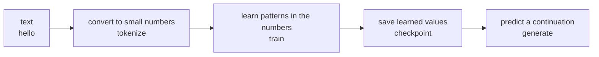
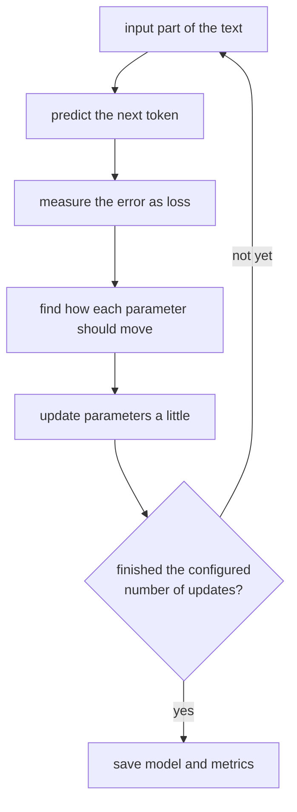
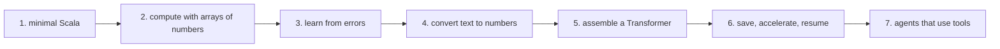
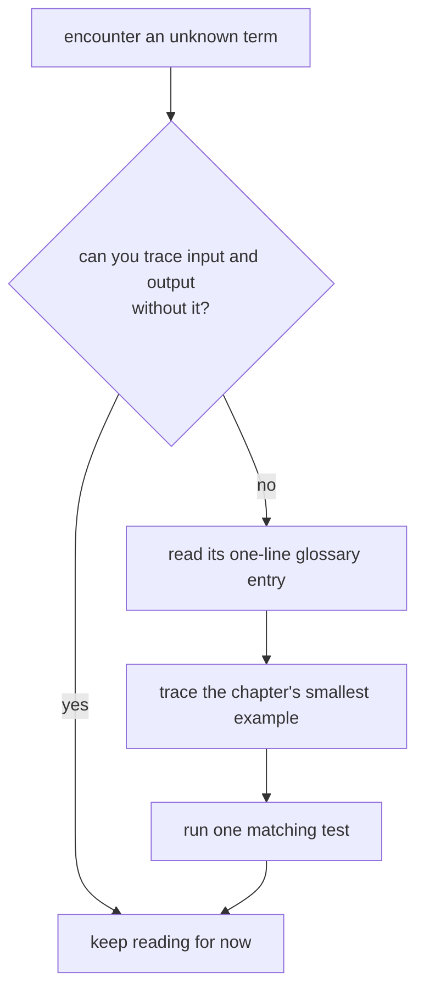

# Visual map and minimum glossary

This page maps what the repository builds before asking you to memorize specialist terms.
You do not need to understand everything at once. Return here when a word blocks the flow.

## The actual prerequisites

You only need to be able to:

1. open a file and edit text;
2. paste a documented command into a terminal;
3. recognize addition and multiplication, and ask when a step is unclear.

No Scala, calculus, probability, or machine-learning experience is required. Equations are
short descriptions of values computed by code, not facts to memorize.

## Start with this one pipeline

A language model receives text and assigns scores to possible continuations.

The first half builds each box from left to right. The second half makes the same boxes faster,
safer, persistent, and recoverable.

## What training does

Training is a loop: measure a prediction error and slightly adjust configurable numbers.

Following the arrows is enough. `gradient` and `optimizer` are later names for boxes D and E.

## Course route

Continue when you can describe a box's input, output, and failure conditions in your own words.

## Minimum glossary

| Term | Plain meaning in this course | First chapters |
| --- | --- | --- |
| model | adjustable computation that turns input into a prediction | 09, 17 |
| token | small number used to represent part of text | 14 |
| tokenizer | converts between text and token sequences | 14, 15 |
| parameter | number changed during learning | 09 |
| loss | one number measuring how wrong a prediction was | 09 |
| gradient | clue about which direction reduces loss | 08, 10 |
| optimizer | rule that updates parameters using gradients | 13 |
| tensor | shaped collection of numbers, such as a table | 12 |
| shape | number of values along each tensor direction | 06, 12 |
| batch | several examples processed together | 16 |
| training | repeatedly measure loss and update parameters | 09, 22b |
| inference | predict without changing trained parameters | 23 |
| checkpoint | file used to load a model later | 25 |
| context | previous tokens visible to one prediction | 16, 19 |
| attention | computes how strongly each context token is consulted | 19 |
| Transformer | model design combining attention with other layers | 20 |
| update | one parameter-changing step | 22b |
| validation | measure on examples not used for updates | 22b |
| seed | starting number that reproduces a random sequence | 07, 16 |
| agent | program managing model output, tools, and stopping | 33–39 |
| tool | capability outside the model, such as file search | 34 |

Knowing terminology is not a completion criterion. Tracing one concrete input is what matters.

## When you get stuck

Run `./learn-ai foundations`, then `./learn-ai xor`, then `./learn-ai bigram` to connect the
computation in small stages.

