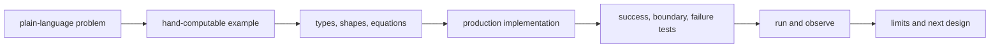

# Explanation and implementation coverage audit

## Conclusion

This repository is **not yet comprehensive across its declared curriculum**.
As of 2026-07-12, 53 of 77 items (69%) are implemented and 24 (31%) are planned.

Implemented does not merely mean that a source file exists. It requires prose,
implementation, colocated declarative tests, a runnable or observable path, and
explicit limitations. `RepositoryCoverageSuite` guards against structural loss
of that evidence.

## What was counted

| Evidence | Current value | Meaning |
| --- | ---: | --- |
| Curriculum items | 77 | learning scope claimed by this course |
| Implemented | 53 | chapter, code, and verification path exist |
| Planned | 24 | explanation or implementation remains incomplete |
| Production Scala | about 9,200 lines | standard-library-centered implementation |
| Declarative tests | 336 cases | success, boundary, failure, and numerical properties |
| Canonical English prose | about 70,000 words | source mirrored by Japanese translations |

Line count is not a quality proof. It only makes the scale visible without
hiding missing areas.

## Audit contract for implemented scope

A ✅ item requires:

1. a plain problem statement before specialist terminology;
2. inputs, outputs, shapes, and failure conditions;
3. an execution-order walkthrough, not only finished code;
4. a colocated `*Suite.scala` declaring properties with `specify(...)`;
5. independent references, finite differences, or properties for numerical work;
6. separation of what an observation proves and does not prove;
7. explicit differences between the small implementation and production systems.

## The 24 areas not yet covered

| Area | Missing items | Required artifacts |
| --- | --- | --- |
| Mathematics | deeper linear algebra, inference | SVD/conditioning and estimation/interval/calibration |
| Tensor | execution model, precision | broadcast/view/batch and float formats/loss scaling |
| Data | corpus manifests/shards | provenance, bounded streaming, resumable shards |
| Distributed/serving | tensor/pipeline parallel, ZeRO, scheduler | partitioning, schedules, recovery, overload tests |
| Architecture | MoE | routing, capacity, balancing, dropped-token tests |
| Scaling/data quality | scaling laws, dedup, filters, mixtures | uncertainty, precision/recall, lineage, eval overlap |
| Post-training | reward model, DPO, policy optimization | preferences, reference ratios, KL/reward-hacking tests |
| Evaluation/release | LM/safety evaluation, release evidence | slices, adversarial suites, model/data/system cards |
| Agent operations | providers, durability, sandbox, hybrid retrieval | failover, event store, quotas/isolation, fusion/reranking |

These rows do not become ✅ by adding terminology. Each needs implementation,
tests, a chapter, and an executable observation.

## Current guarantees and non-guarantees

For 53 items, the target is a path that lets a learner reconstruct the minimal
mechanism and observe failure paths. `sbt check` verifies formatting, compilation,
336 cases, translation pairing, chapter structure, implementation/test
colocation, and file-level Scaladoc presence.

It does not guarantee frontier-scale GPU training, production SLAs, security or
legal certification, completion of the 24 planned areas, or correctness for all
untested inputs.

The accurate assessment is: the current ✅ scope is broad and evidence-backed,
while the declared curriculum is 69% complete. The [curriculum](01-curriculum.md)
is canonical, and this audit plus automated checks prevents inflated claims.
