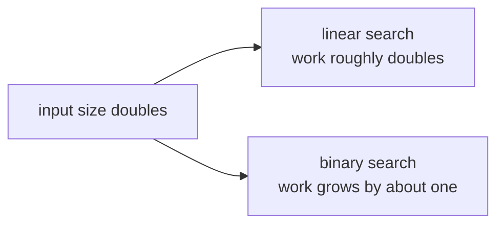

# 03a — Complexity and representation

## What you will build

You will build deterministic cost experiments for linear search, binary search,
row-major matrix traversal, growing arrays, and dense floating-point storage.
The goal is not to memorize notation. It is to predict how much work or memory
an input requires before running a benchmark.

Source and executable specification are colocated in
`src/main/scala/learnai/foundations/Complexity.scala` and
`ComplexitySuite.scala`. Run the lab with `./learn-ai complexity`.

## The problem before the terminology

Two programs can return the same answer while requiring very different work.
Searching one million values from left to right may inspect every value. A
sorted collection lets us inspect the middle and discard half the remaining
range. Likewise, two loops can read every matrix cell but visit memory in an
order that is friendly or hostile to the processor cache.

Big-O notation names growth patterns, but first inspect concrete counts:



For 1,024 sorted values, an unsuccessful linear search makes 1,024 equality
comparisons. Binary search needs at most 11 comparisons. Both results are
correct; their scaling behavior differs.

## A hand-computable example

Search `[2, 5, 8, 11, 14, 17, 20, 23]` for `14`.

Linear search compares `2`, `5`, `8`, `11`, then `14`: five comparisons.
Binary search first inspects index 3 (`11`). Because `14` is larger, indices
0–3 are discarded. It then inspects index 5 (`17`), discards the upper side,
and finally finds index 4 (`14`): three comparisons.

For a 2 by 3 row-major matrix, logical coordinates map to flat offsets as
`offset = row * columns + column`:

```text
coordinates: (0,0) (0,1) (0,2) (1,0) (1,1) (1,2)
offsets:          0     1     2     3     4     5
```

Row-first traversal reads `0,1,2,3,4,5`. Column-first traversal reads
`0,3,1,4,2,5`. Both visit all cells, but only the first reads adjacent storage
continuously.

## Terms in plain language

- **time complexity**: how operation count grows with input size;
- **space complexity**: how required storage grows;
- **payload**: bytes that directly store values, excluding object headers;
- **locality**: using nearby memory close together in time;
- **allocation**: reserving storage for a new object or array;
- **amortized**: an occasional expensive operation averaged across many cheap ones.

`O(n)` means the counted work grows in proportion to `n`. `O(log n)` means a
constant multiplication of input adds a small fixed amount of work. Big-O does
not report seconds, constant factors, JVM warmup, or memory overhead.

## Implementation walkthrough

`linearSearch` owns an index. Every inspected element increments the observable
comparison count. Finding a match returns immediately, so the count describes
the inspected prefix. A miss returns `values.size`.

`binarySearch` owns an inclusive `[low, high]` range. The midpoint expression
`low + (high - low) / 2` avoids the overflow risk of `(low + high) / 2`.
After one comparison, either the result is found or at least half of the current
candidate interval is removed. The API accepts only integers because this
chapter keeps ordering explicit rather than introducing a generic ordering API.

`rowMajorOffset` uses `Math.multiplyExact` and `Math.addExact`. Silent integer
overflow would produce a valid-looking wrong address, so representation
failure is rejected at the boundary. `traversalOffsets` returns exact indices;
it does not pretend a noisy wall-clock measurement proves cache behavior.

`doublingArrayCopies` simulates a dynamic array whose capacity begins at one.
When full, it doubles capacity and copies the existing values. Appending at a
growth boundary is expensive, but the total copied elements before `n` appends
stays below `2n`. That is the amortized argument behind common array buffers.

`doublePayloadBytes` multiplies element count by eight. This is payload only.
A JVM array also has a header, alignment, and reference ownership; measuring
those details requires a layout tool and depends on the runtime.

## Reading the declarative tests

`ComplexitySuite` names properties rather than private helper methods. The
linear-search test distinguishes first, last, and missing values. The binary
test uses a power-of-two range so its logarithmic upper bound is independently
obvious. The traversal test proves equal coverage and different order. The
growth test checks every size below 1,000 against the `2n` bound. Payload tests
cover exact arithmetic, negative input, and overflow.

These tests deliberately avoid timing assertions. Shared CI machines, JIT
compilation, CPU frequency, and background work make tiny timing thresholds
flaky. Later benchmark chapters measure distributions after warmup; this chapter
first establishes the deterministic work model those measurements interpret.

## Run and observe

```console
$ ./learn-ai complexity
```

Predict each comparison count before reading it. Notice that payload bytes grow
linearly for both algorithms; lower comparison count does not mean zero storage.
Then compare the two 2 by 3 traversal orders.

## Debugging checklist

1. If binary search misses an existing value, write `low`, `middle`, and `high`
   for every iteration and check inclusive boundaries.
2. If an offset is wrong, calculate `row * columns + column` by hand.
3. If a byte count is negative, use exact arithmetic and reject overflow.
4. If timing contradicts operation counts, separate JVM warmup and measurement
   noise from algorithmic growth.
5. If a collection grows slowly, inspect allocation and copying rather than
   assuming the loop body is responsible.

## Limitations and next connection

The lab counts selected operations, not CPU instructions. It does not model
branch prediction, cache hierarchy, SIMD, garbage collection, object headers,
or compiler optimization. Chapter 03b observes JVM process boundaries. Later
Tensor, attention, KV-cache, quantization, and distributed chapters reuse these
cost models for shapes, bytes, and communication.

## Exercises

1. Add comparison counting to insertion sort and predict its best and worst case.
2. Add a fixed-capacity growth policy and compare total copies with doubling.
3. Derive payload bytes for an `r × c` matrix of `Double` values.
4. Explain why binary search requires sorted input and add validation if desired.

## Completion criteria

- Predict linear and logarithmic comparison growth.
- Convert a matrix coordinate to a row-major offset.
- Separate payload bytes from JVM object overhead.
- Explain amortized array growth with a total-copy bound.
- State why deterministic counts and benchmark timings answer different questions.

