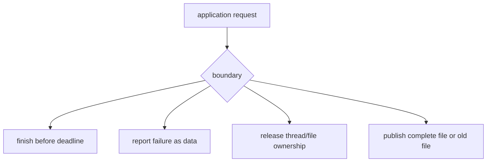
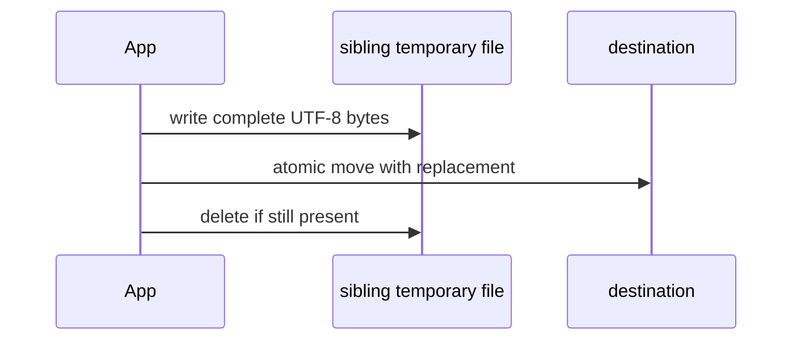

# 03b — JVM systems boundaries

## What you will build

You will build three small but production-shaped boundaries: a JVM capacity
snapshot, execution of owned work with a deadline, and atomic UTF-8 file
replacement. These are the foundations beneath later benchmarks, tool
timeouts, checkpoints, and reproducible run artifacts.

The implementation and declarative specification are colocated in
`src/main/scala/learnai/foundations/JvmSystems.scala` and
`JvmSystemsSuite.scala`. Run `./learn-ai jvm` to inspect your process.

## The problem before the terminology

A correct numerical formula is not enough when it runs inside a process. The
process has a finite heap and a finite number of processors. Work can hang.
Threads must be stopped. Files can be observed between writes. Exceptions can
cross boundaries and erase useful context.



This chapter makes those responsibilities visible. It does not teach every JVM
subsystem; it establishes contracts later components can depend on.

## JVM, JIT, heap, and GC in plain language

Scala source is compiled to JVM bytecode. The JVM interprets or compiles that
bytecode for the current machine. The **JIT** (just-in-time compiler) observes
running code and may optimize frequently executed paths. The first execution
can therefore behave differently from later executions.

The **heap** stores most objects and arrays. `maxMemory` is the upper limit the
JVM may request, `totalMemory` is the currently allocated heap region, and
`freeMemory` is unused space inside that allocated region. None of these is
exact live-object size. Native memory, thread stacks, class metadata, and mapped
files live outside the ordinary heap accounting.

The **garbage collector** finds heap objects that are no longer reachable and
reclaims their storage. A GC pause appearing during one timing sample does not
mean the algorithm changed complexity. It means runtime work overlapped the
measurement. Later benchmark code warms up, repeats, and reports distributions
rather than trusting one duration.

## Ownership before concurrency

Concurrency means more than starting a thread. Whoever creates an executor owns
its shutdown. Whoever creates a task owns cancellation policy. Whoever catches
a timeout decides whether interrupted work can still perform side effects.

`runBounded` creates exactly one worker executor, submits exactly one `Callable`,
and waits for no longer than the supplied duration. Its result is explicit:

```scala
enum BoundedResult[+A]:
  case Completed(value: A)
  case TimedOut
  case Failed(message: String)
```

Returning a sum type prevents callers from confusing timeout, computation
failure, and a valid value. The executor is shut down in `finally`, including
when the task throws.

## Atomic file publication

Writing directly to a destination can expose a truncated file if the process
stops halfway. The safer local pattern is:



The temporary file is created in the destination directory because atomic move
is generally a filesystem-local operation. A reader observes either the old
destination or the complete new destination, not an intentionally published
partial payload. Hardware and filesystem durability after power loss is a
different contract and may require `fsync`; this lab does not claim it.

## Implementation walkthrough

`snapshot` asks `Runtime.getRuntime` for processor and heap values and reads Java
identity from system properties. The case class records raw bytes rather than
formatting units, so callers can choose MiB, GiB, or exact accounting. A snapshot
is an observation, not a capacity reservation; values may change immediately.

`runBounded` rejects zero and negative deadlines. It submits a by-name body as a
`Callable`, waits with `Future.get`, and converts three outcomes to data. A
timeout calls `cancel(true)`, which requests interruption. Cooperative blocking
operations such as `Thread.sleep` react to interruption, but arbitrary code can
ignore it. That is why a thread timeout is not a security sandbox.

Failure catches non-fatal exceptions and preserves the underlying cause when an
executor wrapper provides one. Fatal JVM conditions are not converted into
ordinary application errors. The `finally` block calls `shutdownNow` and waits
briefly for termination so worker ownership cannot silently leak on the success
path.

`writeUtf8Atomically` resolves an absolute destination, creates its parent,
writes exact UTF-8 bytes to a sibling temporary file, and moves it with
`ATOMIC_MOVE` plus replacement. Its `Either` boundary adds operation context
without forcing every caller to catch filesystem exceptions. The `finally`
cleanup is safe after a successful move because the temporary path no longer
exists.

## Reading the declarative tests

The snapshot test checks only portable invariants: positive processor and heap
limits, non-negative free space, and non-empty runtime identity. It does not
assert machine-specific values.

The bounded-execution tests cover success, an exception, and a real deadline.
The timeout fixture sleeps, which is interruptible. The test checks the public
outcome rather than executor internals. The atomic-write test writes twice,
verifies replacement, checks exact UTF-8 byte length for Japanese text, and
reads the final content through the filesystem.

Together these cases describe observable contracts. They do not prove that all
tasks terminate after interruption or that every filesystem supports atomic
replacement.

## Run and observe

```console
$ ./learn-ai jvm
```

Compare maximum heap with currently allocated heap; they should not be treated
as synonyms. Run twice and notice that identity remains stable while allocation
may change. The completed bounded task should return `42`.

## Debugging checklist

1. If a process remains alive, identify every executor and who shuts it down.
2. If a timeout returns but work continues, check whether the task observes
   interruption and whether the operation has side effects.
3. If heap numbers seem inconsistent, distinguish maximum, allocated, and free
   allocated heap before subtracting values.
4. If readers see partial files, confirm writes go to a sibling temporary path
   and publication uses atomic replacement.
5. If a benchmark changes after several runs, separate JIT warmup and GC noise
   from changes in the algorithm or input.

## Limitations and next connection

This lab is not a profiler, scheduler, process sandbox, or durable database. It
does not expose GC events, native memory, virtual threads, structured
concurrency, file locking, network protocols, `fsync`, or crash recovery.
Later benchmark chapters label runtime observations; checkpoint chapters use
atomic publication and checksums; agent chapters add timeout, retry, idempotency,
and approval policy. Production isolation requires process or container
boundaries in addition to thread cancellation.

## Exercises

1. Format heap bytes as MiB without changing the recorded raw values.
2. Add a cancellation-aware loop that checks thread interruption.
3. Record start/end monotonic time around bounded work without asserting a tiny
   fixed duration in tests.
4. Explain why atomic rename and durable power-loss recovery differ.

## Completion criteria

- Explain bytecode, JIT warmup, heap values, and GC without treating them as one mechanism.
- Identify executor, task cancellation, and shutdown ownership.
- Distinguish completion, timeout, and failure at the type level.
- Explain why a sibling temporary file prevents intentional partial publication.
- State why thread interruption is not a security sandbox.

