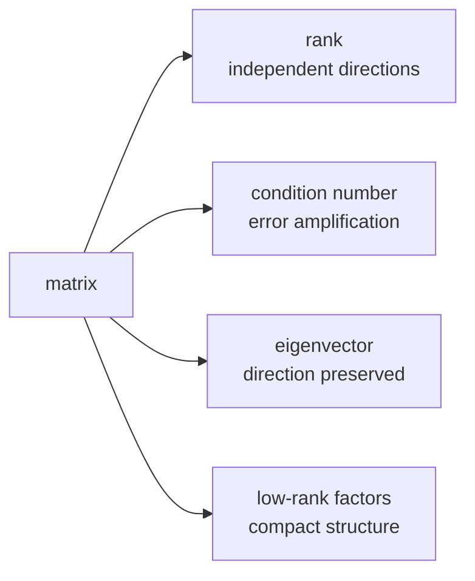

# 08a — Rank, conditioning, eigenvectors, and low-rank structure

## What you will build

This chapter extends vectors and matrices with four diagnostic tools: numerical
rank, dominant-eigenvector estimation, exact singular values for a 2 by 2
matrix, and outer products. Together they explain why some transformations lose
information, why some systems amplify tiny errors, and why LoRA can represent a
large update with two narrow factors.

The implementation and tests are colocated in `LinearAlgebra.scala` and
`LinearAlgebraSuite.scala`. Run `./learn-ai linear-algebra`.

## The problem before the terminology

A matrix can have many rows yet repeat the same information. It can be
invertible but so sensitive that rounding noise dominates a solution. Repeated
multiplication can reveal one direction that grows faster than all others. A
large table can sometimes be approximated by a small number of outer products.



These questions are different. A single scalar called “matrix quality” cannot
replace them.

## Hand-computable examples

The rows `[1,2]` and `[2,4]` point in the same direction. Subtracting twice the
first from the second produces `[0,0]`, so the matrix has rank one. The identity
matrix has two independent rows and rank two.

For the diagonal matrix `diag(4,2)`, the unit axes are eigenvectors. Their
eigenvalues are 4 and 2. Its singular values are also 4 and 2, so its spectral
condition number is `4 / 2 = 2`. The matrix `diag(1000,0.001)` has condition
number one million: relative error aligned with the weak direction can be
amplified dramatically.

The outer product of `[1,2]` and `[3,4,5]` is:

$$
\begin{bmatrix}1\\2\end{bmatrix}
\begin{bmatrix}3&4&5\end{bmatrix}
=
\begin{bmatrix}3&4&5\\6&8&10\end{bmatrix}.
$$

Every row is a multiple of the first, so this 2 by 3 matrix has rank one even
though it stores six values.

## Terms and shapes

- **rank**: count of independent row or column directions;
- **eigenvector**: nonzero vector whose direction is preserved by a square matrix;
- **eigenvalue**: scale applied to that eigenvector;
- **singular value**: non-negative strength of a matrix along paired input/output directions;
- **condition number**: largest singular value divided by the smallest;
- **residual**: how far an approximate result is from satisfying its equation;
- **low rank**: representable with fewer independent directions than dimensions suggest.

For `A: [m,n]`, an outer product `u: [m]` and `v: [n]` produces `uvᵀ: [m,n]`.
An eigenpair applies only to square `A: [n,n]` and satisfies `Av = λv`.

## Implementation walkthrough

`rank` copies the immutable matrix into a working array. For each column it
selects the remaining row with the largest absolute pivot. This partial
pivoting avoids dividing by an unnecessarily tiny value. If the best pivot is
larger than the caller’s tolerance, the algorithm swaps it into place and
eliminates entries below it. The number of accepted pivots is numerical rank.
The tolerance is part of the answer: floating-point data does not have a
universal exact-zero threshold.

`dominantEigenpair` normalizes an initial nonzero vector, repeatedly multiplies
by the matrix, and normalizes again. Directions associated with smaller
eigenvalue magnitudes shrink relative to the dominant direction. The Rayleigh
quotient `vᵀAv` estimates the eigenvalue. Convergence is not declared from a
changing vector alone; the code measures residual norm `||Av - λv||`.

`singularValues2x2` forms the Gram matrix `AᵀA`. Its eigenvalues are squared
singular values. A 2 by 2 characteristic polynomial has a closed-form solution,
so this lab can independently expose singular values without importing a
numerical library. `conditionNumber2x2` refuses a smallest singular value at or
below tolerance instead of returning a misleading huge finite number.

`outer` directly evaluates `left(row) * right(column)`. This primitive reappears
in gradient formulas and low-rank adapters. A sum of `r` outer products has rank
at most `r`, which is the storage and expressiveness tradeoff behind factorized
updates.

## Reading the declarative tests

The rank tests cover identity, duplicate rows, and an all-zero rectangular
matrix. Expected answers come from hand elimination. The power-iteration test
uses `[[3,1],[1,3]]`, whose dominant eigenvector is proportional to `[1,1]` and
eigenvalue is 4; it additionally requires a small residual and unit norm.

The singular-value test uses a diagonal matrix, giving an independent oracle.
The condition test passes a duplicate-row matrix and expects an explicit error.
The outer-product test checks every value and then verifies rank one. These are
focused properties; a single model-training test could not identify which
linear-algebra contract failed.

## Run and observe

```console
$ ./learn-ai linear-algebra
```

Predict rank, dominant eigenvalue, and condition number first. The residual—not
the printed number of decimal places—is the evidence that the estimated vector
satisfies the eigen equation.

## Debugging checklist

1. If rank changes unexpectedly, print pivot magnitudes and state the tolerance.
2. If elimination produces non-finite values, confirm the largest available
   pivot was selected before division.
3. If power iteration stalls, check whether dominant magnitudes are tied or the
   initial vector is orthogonal to the dominant direction.
4. If a condition number is huge, inspect the smallest singular value rather
   than merely widening a comparison tolerance.
5. If a low-rank reconstruction has wrong shape, write factor shapes before multiplying.

## Limitations and next connection

The closed-form singular-value implementation is intentionally restricted to
2 by 2 matrices. Production SVD uses stable iterative factorizations and reports
convergence. Rank depends on scale-aware tolerance; this reference uses an
absolute tolerance. Power iteration finds only one dominant direction and may
fail to select uniquely when magnitudes tie.

Later chapters use low-rank factors in LoRA, conditioning in precision analysis,
singular directions in scaling diagnosis, and outer products in gradients.

## Exercises

1. Scale a matrix by one million and design a relative rank tolerance.
2. Compare power iteration residuals for matrices with large and small eigenvalue gaps.
3. Sum two outer products and construct examples of rank one and rank two.
4. Explain why `AᵀA` can worsen conditioning in a production algorithm.

## Completion criteria

- Determine rank by hand elimination.
- Explain eigenvalue, singular value, and condition number as different quantities.
- Use a residual to evaluate an approximate eigenpair.
- Derive the shape and rank bound of an outer product.
- State the numerical limitations of the reference algorithms.

