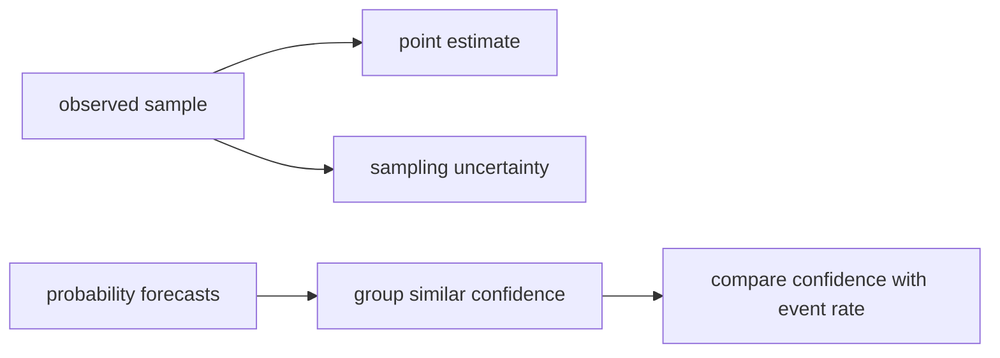

# 08b — Estimation, uncertainty, and calibration

## What you will build

You will build a sample mean, unbiased sample variance, a confidence interval
for a mean, reliability bins for probability forecasts, and expected
calibration error. These tools turn a list of measurements into a claim that
includes uncertainty rather than reporting one unexplained average.

Implementation and executable specification are colocated in
`src/main/scala/learnai/math/Statistics.scala` and `StatisticsSuite.scala`.
Run the observations with `./learn-ai statistics`.

## The problem before the terminology

Suppose two model evaluations report accuracy `0.80`. One used five examples;
the other used fifty thousand. The printed averages match, but the evidence
does not. A small sample can change sharply when one example changes. A large
sample usually gives a more stable estimate of the population it represents.

Probability predictions introduce a second question. A model that says “80%”
should be correct about 80% of comparable cases. Accuracy alone cannot tell us
whether its probabilities mean what they claim.



## Hand-computable estimates

For observations `[1,2,3]`, the mean is `(1+2+3)/3 = 2`. Deviations from the
mean are `[-1,0,1]`; squared deviations sum to 2. Sample variance divides by
`n-1`, so `s² = 2/2 = 1`. The estimated standard error of the mean is
`s / sqrt(n) = 1/sqrt(3)`.

Using `z = 2` for an easy approximate interval gives:

$$
2 \pm 2\frac{1}{\sqrt{3}}.
$$

This interval is generated by a normal approximation. It is not a promise that
the true mean has a 95% probability of being inside this already-computed
interval. Under repeated sampling and the model assumptions, the procedure
captures the population mean at its advertised long-run rate.

For calibration, consider forecasts `(0.2, outcome 0)` and `(0.8, outcome 1)`.
If each occupies its own bin, prediction means are 0.2 and 0.8 while event rates
are 0 and 1. Each bin has absolute gap 0.2, so equally weighted expected
calibration error is 0.2.

## Terms in plain language

- **population**: the full set of cases the claim is intended to describe;
- **sample**: observed cases used to estimate that population;
- **estimator**: a rule that converts a sample into an estimate;
- **bias**: systematic difference between an estimator's expectation and target;
- **variance**: how much an estimate changes across repeated samples;
- **standard error**: estimated spread of an estimator, not of individual values;
- **confidence interval**: interval procedure with repeated-sampling coverage;
- **calibration**: agreement between stated probabilities and observed frequencies;
- **binning**: grouping nearby predictions to obtain observable frequencies.

## Equations and code names

For values `x₁ ... xₙ`, `sampleMean` computes:

$$
\bar{x}=\frac{1}{n}\sum_{i=1}^{n}x_i.
$$

`sampleVariance` computes the unbiased variance estimate:

$$
s^2=\frac{1}{n-1}\sum_{i=1}^{n}(x_i-\bar{x})^2.
$$

`meanConfidenceInterval` uses standard error `SE = s/sqrt(n)` and returns
`x̄ ± z SE`. The caller may supply `z`; the default is the common two-sided
normal 95% critical value.

For calibration bin `b`, `reliability` records count, mean prediction `p_b`, and
event rate `y_b`. `expectedCalibrationError` computes:

$$
\operatorname{ECE}=\sum_b\frac{n_b}{n}|p_b-y_b|.
$$

## Implementation walkthrough

`sampleMean` rejects an empty vector because division by zero would invent a
result. It uses compensated summation from the numerics chapter so small
contributions are less easily lost beside large values.

`sampleVariance` requires two observations. Dividing by `n-1` corrects the bias
introduced because the same sample estimates its own mean. This does not make
variance estimates noiseless; it corrects one specific expected-value bias.

`meanConfidenceInterval` validates a positive finite critical value, composes
the mean and variance error channels, computes standard error, and returns all
components in `MeanEstimate`. Keeping mean, standard error, bounds, and sample
count together prevents a bound from being reported without its evidence size.

`ProbabilityForecast` validates probability range and binary outcomes at
construction. `reliability` assigns `p=1` to the final bin explicitly; naive
`(p * bins).toInt` would otherwise produce an out-of-range index. Empty bins are
omitted because assigning them a prediction or event rate would fabricate data.

ECE weights each populated gap by its fraction of all forecasts. An unweighted
average of bins would let a bin with one observation count as much as a bin with
ten thousand. The API rejects an empty forecast set because calibration error
would have no denominator.

## Reading the declarative tests

The mean and variance test uses `[1,2,3]`, whose values are independently
calculable. The interval test supplies `z=2`, checks standard error, symmetry,
and retained sample count. Undefined cases cover empty mean, one-value variance,
and invalid critical value.

A perfect deterministic forecast test uses probability zero with outcome zero
and probability one with outcome one, requiring ECE zero. The final test creates
two occupied and two empty bins, checks that empties are omitted, independently
computes weighted ECE, and verifies that an empty forecast set is refused.

## Run and observe

```console
$ ./learn-ai statistics
```

Before running, calculate the mean of `1..5` and predict whether the interval
width is zero. Inspect reliability bins separately from the single ECE summary;
the summary can hide which confidence region is wrong.

## Debugging checklist

1. If variance is too small, check whether the denominator should be `n` or `n-1`.
2. If an interval narrows when noise increases, inspect standard deviation and sample count separately.
3. If probability one crashes bin assignment, clamp it to the final bin.
4. If ECE changes dramatically with bin count, print bin counts and treat sparse bins as uncertain.
5. If an evaluation looks precise, verify examples are independent and representative before trusting the formula.

## Limitations and next connection

The confidence interval is a normal approximation. Small non-normal samples
often need a Student-t interval or a bootstrap. The code does not model
correlated examples, dataset shift, multiple comparisons, stratified sampling,
or causal claims. ECE depends on bin boundaries and can hide cancellation or
sparse-region uncertainty; calibration plots and proper scoring rules remain
necessary.

Later scaling experiments use uncertainty around fitted relationships. Model
evaluation uses slices and repeated trials. Safety evaluation needs uncertainty
without treating the absence of observed failures as proof of safety.

## Exercises

1. Add a Student-t critical-value table for small sample sizes.
2. Implement a deterministic seeded bootstrap interval and compare it with the normal approximation.
3. Add Brier score and show that calibration and discrimination are different.
4. Split forecasts into named data slices and prevent a large slice from hiding a small failing slice.

## Completion criteria

- Compute sample mean, unbiased variance, and standard error by hand.
- Interpret a confidence interval as a repeated-sampling procedure.
- Distinguish individual-value spread from estimator uncertainty.
- Build a reliability table and weighted ECE.
- State assumptions and binning limitations before using one summary number.

