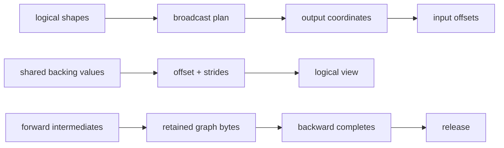

# Tensor execution model: shapes are not enough

## The problem in plain language

A tensor is often introduced as “an array with a shape.” That definition is useful, but it leaves
out four questions that determine whether a real program is correct and affordable:

1. When two shapes differ, which values are repeated?
2. When several examples are processed together, which computations may interact?
3. Does changing the apparent axis order copy data or only change how it is addressed?
4. Which intermediate values remain in memory until backward finishes?

Chapter 12 deliberately required exactly equal shapes. That made every gradient route visible. This
chapter adds an explicit execution layer instead of quietly changing `Tensor.+`. The separation is
important: `BroadcastPlan`, `StridedView`, `BatchedMatmul`, and `GraphLifetime` can be inspected and
tested independently before they become optimizations inside a larger tensor runtime.

Run the lab with:

```bash
./learn-ai tensor-execution
```

## A picture of the execution decisions



The main lesson is that a logical tensor and its physical storage are related but not identical.
A shape describes valid coordinates. Strides describe how a coordinate reaches storage. A
broadcast plan maps many output coordinates to the same input offset. A graph-lifetime owner says
how long saved values remain reachable.

## Broadcasting by hand

Suppose the left input has shape `[2,1]` and values `[[10],[20]]`. The right input has shape
`[1,3]` and values `[[1,2,3]]`. Dimensions are aligned from the right. Equal dimensions are kept;
a dimension of one may be repeated. The output shape is `[2,3]`:

```text
left offsets   0 0 0 1 1 1
right offsets  0 1 2 0 1 2
sum           11 12 13 21 22 23
```

No six-element copy of either input is necessary. `BroadcastPlan` stores the offset maps. During
backward, repetition must be reversed by addition. For upstream gradients `[1,2,3,4,5,6]`, the
left gradient is `[1+2+3, 4+5+6] = [6,15]`; the right gradient is `[1+4,2+5,3+6] = [5,7,9]`.
Forgetting this reduction is a common silent bug: the forward values look right while parameter
gradients have an expanded shape or lose contributions.

Shapes `[2,3]` and `[2,4]` are not broadcast-compatible. Neither final dimension is one, so the
planner returns an error naming axis 1. Failing during planning is preferable to discovering the
mistake halfway through a numerical loop.

## Batches are an isolation contract

A batch groups independent examples so one operation can process them together. Batched matrix
multiplication uses shapes `[B,M,K] × [B,K,N] -> [B,M,N]`. The batch index selects a pair of
matrices; it is not part of the dot product. For two batches:

```text
batch 0: [1,2] dot [3,4]   = 11
batch 1: [10,20] dot [5,6] = 170
```

`BatchedMatmul` is a dense forward reference implementation. It intentionally returns a detached
constant and does not yet implement backward or broadcasted batch dimensions. That limitation is
visible rather than hidden. A production differentiable kernel would save or recompute operands,
produce gradients for both inputs, support more ranks, and dispatch to optimized BLAS/GPU code.

## Views: change addressing, not values

A contiguous `[2,3]` row-major tensor has strides `[3,1]`. Coordinate `[row,column]` reaches
`row * 3 + column`. Transposing it to logical shape `[3,2]` can swap dimensions and strides to
`[1,3]`. The backing vector remains the same object:

```text
backing:       1 2 3 4 5 6
logical view:  1 4
               2 5
               3 6
```

`StridedView.transpose` changes only metadata. `materialize` is the explicit copy boundary that
produces `[1,4,2,5,3,6]`. Some kernels can consume arbitrary strides; others require contiguous
input. Making materialization explicit helps explain both performance and aliasing. This course
uses immutable backing vectors, so it avoids the harder question of what happens when two mutable
views overlap. Production runtimes need version counters or mutation rules to keep autodiff safe.

## Graph lifetime and memory

Reverse-mode autodiff evaluates forward first and backward later. Backward formulas may need
forward inputs, outputs, masks, or statistics. Those saved activations remain reachable even if the
application no longer names the final logits. `GraphLifetime.retain` makes a small accounting
contract: the bytes are the checked sum of `shape.size × bytesPerElement`, and `release` changes
bytes in use to zero exactly once.

This is accounting, not a garbage collector. The current `Tensor` graph is still managed by JVM
reachability. A production engine may free nodes eagerly, use reference counts, checkpoint only
selected activations, or recompute parts of forward during backward. The lab teaches the ownership
question before those policies obscure it.

## Implementation walkthrough

Read `TensorExecution.scala` in this order:

1. `BroadcastPlan.between` pads shapes with leading ones, validates each aligned axis, computes the
   output shape, and maps every output flat index to two input offsets.
2. `map` uses those offsets without expanded inputs. `reduceGradient` performs the inverse
   many-to-one addition.
3. `StridedView.contiguous` derives row-major strides. `transpose` swaps dimension/stride metadata,
   and `materialize` enumerates logical coordinates.
4. `BatchedMatmul` decodes each output flat index into batch, row, and column, then performs only the
   `K` reduction.
5. `GraphLifetime` retains checked byte accounting and rejects double release.

The colocated `TensorExecutionSuite` states properties rather than mirroring implementation lines:
known broadcast values, gradient reductions, invalid axes, backing identity, batch isolation, and
lifetime state transitions.

## Reading the tests as a specification

Start with “right-aligned broadcasting maps matrix row and column operands.” Draw its offset table
before running it. Then read the backward reduction test and verify every sum by hand. The view test
uses reference identity (`eq`) to prove that transpose did not copy. The batched matmul example uses
very different magnitudes so accidental cross-batch mixing is obvious. Finally, the lifetime test
checks both the ordinary release and the failure path for a second release.

Run only through the repository test entrypoint:

```bash
./learn-ai test
```

The full suite also protects the earlier no-implicit-broadcasting `Tensor` contract. The new plan is
an explicit mechanism; it does not silently weaken Chapter 12's safety boundary.

## Debugging checklist

- Align dimensions from the right, not the left.
- Treat a missing leading dimension as one.
- Reject unequal dimensions when neither is one.
- During backward, sum every output gradient that mapped to the same input offset.
- Keep batch indices outside the matrix inner-product reduction.
- Check whether a transpose is a view or a materialized copy before estimating bytes.
- Never assume arbitrary strides are accepted by a kernel.
- Account for saved forward values until backward, not only model parameters.
- Release an execution graph only when no backward consumer remains.
- Distinguish JVM object reachability from accelerator-buffer ownership.

## Limitations and next step

This implementation is a correctness model, not a high-performance tensor engine. Broadcasting is
not wired into differentiable `Tensor` operators. `BatchedMatmul` has forward semantics only.
`StridedView` is immutable and supports transpose rather than the full family of slice, expand, and
negative-stride views. `GraphLifetime` accounts bytes but does not control real Tensor storage.

Those omissions are intentional and explicit. A stronger runtime would add a storage object,
view-aware differentiable operations, batched gradient kernels, alias analysis, graph-freeing
tests, and benchmark evidence. The next chapter asks a different execution question: after deciding
which values exist and how long they live, how many bits should store and accumulate them?
