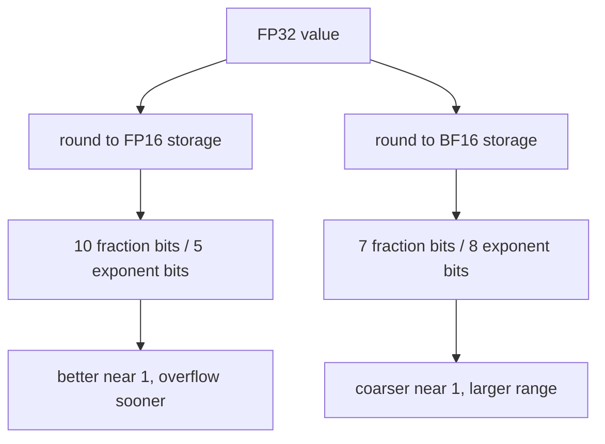
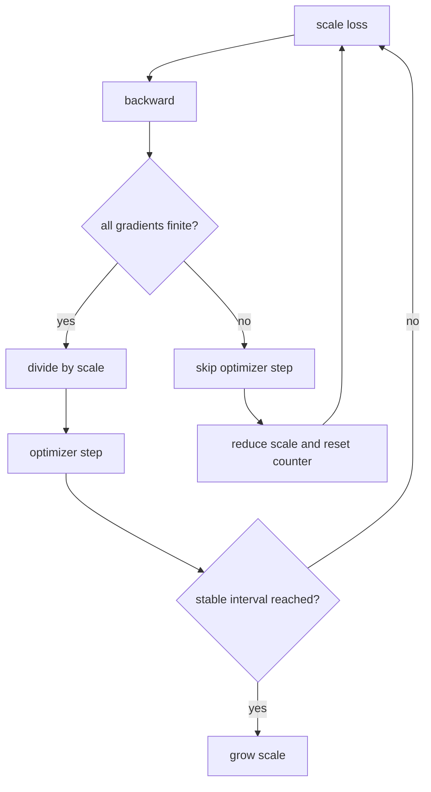

# Precision engineering: storage bits, sums, and loss scaling

## The problem in plain language

Computers do not store most real numbers exactly. Chapter 04 showed that even ordinary `Double`
arithmetic rounds. Neural-network systems add a practical choice: some values are stored in 16 bits
to reduce memory traffic, while important reductions may still use 32 bits. “Mixed precision” is
not one data type. It is a policy describing storage, computation, accumulation, overflow detection,
and optimizer updates.

This chapter builds three inspectable pieces:

- `FloatFormat` rounds values through FP32, IEEE FP16, or BF16 storage;
- `Accumulation` compares a left-associated FP32 sum, FP64 reference, and pairwise FP32 sum;
- `DynamicLossScaler` scales a loss, unscales finite gradients, grows after stable steps, and backs
  off while skipping an update after NaN or infinity.

Run:

```bash
./learn-ai precision
```

## One 16-bit budget, two different choices

A floating-point value uses a sign, exponent, and fraction. More exponent bits increase the range of
magnitudes. More fraction bits distinguish nearby values. FP16 and BF16 both occupy 16 bits but spend
them differently:

| Format | Sign | Exponent | Fraction | Practical consequence |
| --- | ---: | ---: | ---: | --- |
| FP32 | 1 | 8 | 23 | common compute/accumulation baseline |
| FP16 | 1 | 5 | 10 | finer nearby values, much smaller range |
| BF16 | 1 | 8 | 7 | FP32-like range, coarser nearby values |



Near one, FP16 represents `1.001` more closely than BF16. At `100000`, FP16 overflows to infinity,
while BF16 remains finite. Therefore the question “which 16-bit format is more accurate?” has no
single answer. Accuracy depends on the value distribution and operation.

`BFloat16Codec` implements round-to-nearest-even. It keeps the upper 16 FP32 bits and uses the lower
bits to decide whether to increment. At an exact halfway case, the retained least significant bit
selects the even neighbor. Infinity and NaN preserve their exponent payload path instead of being
rounded like finite numbers.

## Storage precision is not accumulation precision

Consider the exact mathematical sum:

```text
100000000 + 1 - 100000000 = 1
```

In FP32, the spacing near one hundred million is larger than one. A left-associated sum first rounds
`100000000 + 1` back to `100000000`, so the result becomes zero. An FP64 accumulator retains the one
for this example.

Pairwise reduction adds a tree rather than one long chain. It often reduces error growth because
numbers of similar scale meet earlier, although it does not guarantee the correctly rounded exact
sum. GPU matrix multiplication commonly reads lower-precision operands and accumulates products in
FP32. Reporting only the input dtype therefore hides a decisive numerical choice.

Associativity also affects reproducibility. Mathematically `(a+b)+c = a+(b+c)`; rounded arithmetic
can disagree. Parallel reduction changes the tree when thread counts, partitions, or kernels change.
Tests should use justified tolerances and, when bitwise replay matters, pin the reduction order.

## Why scale the loss?

Backpropagation repeatedly multiplies derivatives. Some gradients become too small for FP16 and
round to zero. Multiplying the scalar loss by a scale `S` multiplies every gradient by `S` through
the chain rule. Before the optimizer update, divide gradients by the same `S`:

$$
\nabla_\theta (S L) / S = \nabla_\theta L.
$$

This does not change the intended update in exact arithmetic. It moves intermediate gradients into
a representable range. A scale that is too large can instead overflow. Dynamic loss scaling treats
overflow as control flow:



Skipping matters. Replacing infinity with zero and stepping would silently change the optimization
problem. `DynamicLossScaler.unscale` returns an explicit `skipped` flag, an empty gradient vector,
and a backed-off next state when any gradient is non-finite. The caller, not the scaler, owns the
optimizer and must honor that flag.

## A hand-sized scaler trace

Start with scale 1024 and growth interval two. Scaled gradients `[1024,-2048]` unscale to `[1,-2]`.
The scale remains 1024 and the stable counter becomes one. A second finite step reaches the interval,
so the next scale becomes 2048 and the counter resets. If an infinity appears, the result is skipped,
the default backoff multiplies the scale by 0.5, and the stable counter resets.

The floor of one in this educational policy prevents a repeated overflow path from producing a zero
or subnormal scale. Production frameworks expose more controls: initial scale, growth/backoff
factors, growth interval, hysteresis, per-device overflow aggregation, and checkpointed scaler state.

## Implementation walkthrough

Read `PrecisionEngineering.scala` from representation toward policy:

1. `FloatFormat.round` deliberately converts `Double` through an actual finite-width Java storage
   representation and back, making quantization observable.
2. `BFloat16Codec.bits` handles special exponents, applies the `0x7fff + retainedLSB` rounding bias,
   and returns the retained upper word. `fromBits` reverses storage expansion.
3. `Accumulation.naiveFloat32` rounds after every addition. `float64` is the wider reference.
   `pairwiseFloat32` recursively fixes a balanced reduction tree.
4. `DynamicLossScaler` validates its policy at construction. `scaleLoss` describes the forward
   multiplier. `unscale` checks finiteness before division and returns both values and next state.
5. `LossScaleResult` prevents the important skip decision from being inferred from an empty or
   exceptional side channel.

The implementation uses `Double` vectors around conversions because the rest of the course Tensor
stores Double. It demonstrates representation and control semantics; it does not accelerate Tensor
operations or claim lower memory use inside the current runtime.

## Reading the tests as a specification

The first test uses exactly representable values across all formats. The second separates local
precision from range using `1.001` and `100000`. The tie test constructs FP32 values from raw bits so
round-to-nearest-even is checked independently of decimal parsing. The cancellation test gives an
exact hand oracle. Scaler tests declare finite growth, overflow skip/backoff, and invalid policies.

Run the entire suite:

```bash
./learn-ai test
```

Numerical tests should not say merely “the output looks close.” Each tolerance or exact assertion is
tied to a representational fact. For a real training run, also record loss-scale history, skipped
step count, gradient norms before and after unscale, format selection, and reduction implementation.

## Debugging checklist

- Name storage, multiplication, and accumulation formats separately.
- Check both small-value underflow and large-value overflow.
- Compare ULP spacing near the actual magnitude, not only decimal digits.
- Unscale gradients before clipping and the optimizer step.
- Detect non-finite gradients across every parameter and every distributed rank.
- Skip the entire coordinated update after overflow; do not partially step parameters.
- Checkpoint the scaler state when exact resume is required.
- Pin reduction order if bitwise reproducibility is a requirement.
- Treat pairwise summation as error reduction, not proof of an exact sum.
- Measure throughput and memory before claiming that a lower-precision format helps.

## Limitations and production boundary

This lab models formats on the CPU and does not provide FP16/BF16 Tensor storage, vectorized kernels,
hardware tensor cores, stochastic rounding, master FP32 weights, distributed overflow collectives,
or optimizer integration. `Float.floatToFloat16` follows the JVM implementation; BF16 is encoded by
the course codec. Pairwise recursion allocates call frames and is a reference, not a tuned reduction.

A production mixed-precision trainer must define autocast rules per operation, keep sensitive
reductions and optimizer state in appropriate precision, coordinate overflow decisions across ranks,
save scaler state, and validate convergence against a higher-precision baseline. This chapter makes
those contracts concrete without pretending that format conversion alone creates a fast trainer.
