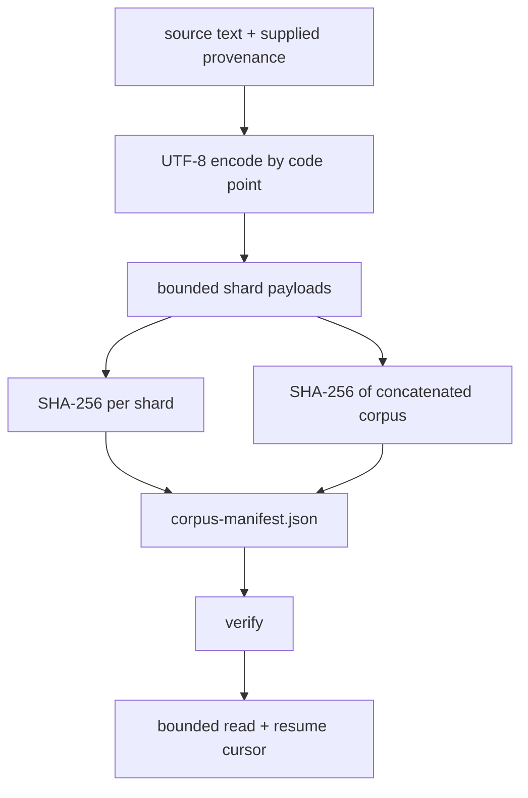

# Corpus manifests and shards: know exactly what the model read

## The problem in plain language

A training script can accept one text file and produce a loss curve. That is enough for a tiny
lesson, but it does not answer basic questions needed to repeat or audit an experiment:

- Where did the text come from, and under which stated license?
- Are the bytes today identical to the bytes used yesterday?
- If the corpus is larger than memory, can it be read in bounded pieces?
- After interruption, can reading resume at exactly the next byte?
- Will a missing, truncated, or silently modified piece be detected before training?

A corpus manifest answers identity and provenance questions. Shards make the payload manageable.
The two form one contract: the manifest names an ordered set of immutable byte intervals, and the
reader refuses to treat different bytes as the same corpus.

Run the complete local example:

```bash
./learn-ai corpus-shards
```

## The artifact set



The directory contains `corpus-manifest.json` and files named
`shard-00000.bin`, `shard-00001.bin`, and so on. A `CorpusShard` records a relative file name,
global `startByte`, positive `byteLength`, and lowercase SHA-256. Intervals must be contiguous:
the first starts at zero, every later start equals the preceding exclusive end, and the last end
equals `totalBytes`.

`CorpusShardManifest` also records schema version, corpus name, whole-corpus SHA-256, and
`CorpusProvenance`. Provenance contains a source string, a declared license string, and a collection
instant. These fields are claims supplied by the corpus owner. Hashes can prove byte identity; they
cannot prove that the source claim is honest or that a license legally permits a particular use.

## Why hash both shards and the whole corpus?

A per-shard digest identifies which physical piece changed and permits local validation. A digest of
the concatenated bytes identifies the logical corpus independently of how an implementation reports
individual failures. Both matter because a set can contain individually valid files in the wrong
order. The ordered manifest plus the whole digest catches that logical mismatch.

SHA-256 maps arbitrary bytes to 256 bits. It is used here for integrity identity, not encryption or
access control. The implementation compares the exact lowercase hexadecimal digest stored in the
manifest. File length is checked before hashing, so truncation produces a direct length error; a
same-length bit flip produces a shard digest error.

Verification streams each file through an 8192-byte buffer. It updates a shard digest and the
whole-corpus digest during the same pass. It does not call `readAllBytes`, so verifier memory is
bounded independently of shard size. This is important: splitting a terabyte corpus into gigabyte
shards does not make a gigabyte allocation acceptable.

## UTF-8-safe shard boundaries

UTF-8 represents one Unicode code point with one to four bytes. Splitting after an arbitrary byte
can leave one shard ending with the first half of an emoji and the next starting with continuation
bytes. Concatenating the files still reconstructs the corpus, but inspecting or independently
decoding a shard becomes confusing.

`CorpusShardBuilder` encodes one code point at a time and adds that complete encoded unit only when
it fits the current shard. Otherwise it starts a new shard. Therefore every shard is independently
valid UTF-8. If the configured maximum is less than one code point—for example three bytes for a
four-byte rocket emoji—construction fails instead of violating the size limit.

For `a`, one three-byte code point, a four-byte rocket emoji, and `b`, under a four-byte limit, the
UTF-8 lengths are 1, 3, 4, and 1. The builder produces three shards with global starts `[0,4,8]`.
No shard exceeds four bytes and no code point is split.

## Bounded reads and exact resume

`CorpusCursor(shardIndex, offsetInShard)` names the next unread byte. `read(cursor, maximumBytes)`
allocates at most the requested payload buffer for each involved shard and may cross shard
boundaries. The returned `CorpusRead` includes bytes, the next cursor, and `endOfCorpus`.

Suppose shards contain `abc`, `def`, `ghi`, `j`, and the read budget is two. The sequence is:

```text
cursor (0,0) -> "ab" -> (0,2)
cursor (0,2) -> "cd" -> (1,1)
cursor (1,1) -> "ef" -> (2,0)
cursor (2,0) -> "gh" -> (2,2)
cursor (2,2) -> "ij" -> (4,0), end
```

Concatenating returned bytes gives the original exactly once: no gap and no duplication. Persisting
the cursor with a training checkpoint lets an input pipeline resume. The cursor alone is not enough;
the checkpoint must also bind to the manifest identity. Otherwise `(1,1)` could refer to different
bytes after a corpus change.

## Atomic publication

Each shard and the JSON manifest are written to a temporary file in the target directory and moved
into place. The builder requests an atomic replacement and uses a same-filesystem replacement
fallback when the platform does not support atomic moves. The manifest is published after shard
files, so readers do not observe a new manifest pointing to not-yet-written payloads during the
ordinary single-writer flow.

This is not a multi-process transaction. Concurrent builders targeting the same directory can race,
and stale extra shards are not removed. Production pipelines normally write to a fresh immutable
version directory, verify it, then atomically update a small catalog pointer or object-store marker.

## Implementation walkthrough

Read `CorpusShards.scala` in this order:

1. `CorpusProvenance`, `CorpusShard`, and `CorpusShardManifest` validate facts at construction. The
   manifest constructor proves interval continuity and total coverage.
2. `json` renders an insertion-ordered schema-one artifact. Stable ordering makes diffs and hashes
   reproducible, although JSON object order should not be treated as semantic by outside systems.
3. `CorpusShardBuilder.build` encodes code points, packs bounded groups, writes shards, computes
   individual/whole digests, then publishes the manifest.
4. `CorpusShardReader.verify` checks existence, length, streaming shard digests, and the final corpus
   digest.
5. `read` validates cursor bounds, opens a seekable file channel, starts at the exact offset, reads no
   more than the remaining budget, and advances across boundaries.
6. `runCorpusShardLab` constructs a temporary multilingual corpus and prints identity, layout,
   verification, and a five-byte bounded observation.

## Reading the tests as a specification

`CorpusShardsSuite` is colocated with the implementation. The first case checks UTF-8 validity of
every physical shard and exact global starts. The second proves deterministic manifests across
different directories. The resume test repeatedly requests two bytes and reconstructs the exact
source. Separate tests mutate one byte, truncate a file, delete a file, provide invalid cursors, and
set a shard limit smaller than an emoji.

```bash
./learn-ai test
```

These are declarative boundary claims, not just line coverage. The corruption fixture distinguishes
length from hash failure. The resume fixture makes a maximum allocation promise observable through
every returned chunk size.

## Debugging checklist

- Hash exact bytes, not decoded/reformatted text.
- Record provenance supplied by an accountable owner; do not infer a license.
- Keep shard names relative and validate their format to prevent path traversal.
- Require ordered byte intervals to be contiguous and cover the declared total.
- Split UTF-8 only between complete code points if shards must decode independently.
- Stream verification through a fixed buffer instead of loading a shard into memory.
- Check length before digest to produce useful truncation evidence.
- Bind a resume cursor to the same manifest/corpus identity in a training checkpoint.
- Publish payloads before the manifest that references them.
- Treat atomic rename as a local-filesystem property, not a distributed transaction.

## Limitations and production boundary

The chapter accepts in-memory source text while building; a truly large builder must stream from a
source and carry incomplete UTF-8 bytes between input buffers. Manifest parsing/loading is not yet a
public API; this implementation creates the typed manifest and writes deterministic JSON. Reads
assume verification has already succeeded and report cursor errors with `Either`, while unexpected
filesystem failures still throw. There is no compression, encryption, remote object-store retry,
concurrent writer lock, stale-file cleanup, data filtering, or legal-policy engine.

The next production steps are schema parsing with migration, manifest identity in training bundles,
streaming source ingestion, content-addressed immutable directories, object-store conditional
publication, per-shard record indexes, and operational metrics. What this implementation already
establishes is the core invariant: a training run can name exact bytes, verify them with bounded
memory, and resume at an explicit next-byte position.
