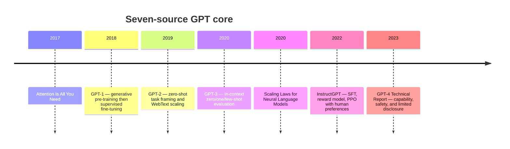
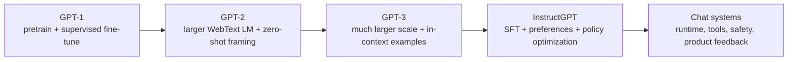
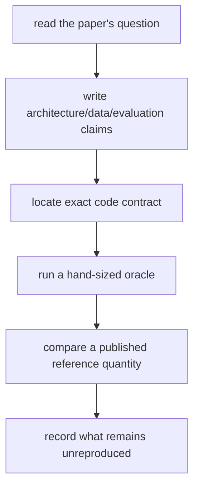

# 42 — GPT lineage, seven core sources, and Karpathy implementations

## Why this chapter exists

The repository previously jumped from *Attention Is All You Need* to GPT-3 and
called its small decoder `MiniGPT`. That hides the research sequence and can
mislead a reader into thinking every decoder-only Transformer is architecturally
or checkpoint compatible with GPT-2. It is not.

This chapter separates three kinds of evidence:

1. a paper's research claim and experiments;
2. an implementation's exact architecture and training recipe;
3. this repository's small mechanism and what it does not reproduce.

## “The divine seven” is not one canonical bibliography

The “divine seven” nickname is used informally for several different
recommended-paper lists. There is no primary-source authority defining one
universal set of seven GPT papers. Rather than attach false precision to the nickname, this course
defines a transparent **seven-source GPT core**. Replace or extend it when a
specific external list is named; every entry must still map to code and an
experiment.

## The seven sources, claim by claim

| Source | What changed | Repository connection | What it does not prove |
| --- | --- | --- | --- |
| [Attention Is All You Need](https://arxiv.org/abs/1706.03762) | Attention-based encoder-decoder replaces recurrence for translation | Chapters 19–20 build attention, residual paths, normalization, and FFN | It is not a decoder-only GPT paper |
| [Improving Language Understanding by Generative Pre-Training](https://cdn.openai.com/research-covers/language-unsupervised/language_understanding_paper.pdf) | Transformer LM pre-training transfers to supervised language-understanding tasks | Chapters 17–22 implement next-token pre-training; SFT appears in 31a | The reported transfer results do not follow from architecture alone |
| [Language Models are Unsupervised Multitask Learners](https://cdn.openai.com/better-language-models/language_models_are_unsupervised_multitask_learners.pdf) | GPT-2 scales decoder-only pre-training and studies zero-shot task formatting | `GptLineage` accounts for exact GPT-2 configurations | MiniGPT cannot load GPT-2 weights |
| [Language Models are Few-Shot Learners](https://arxiv.org/abs/2005.14165) | GPT-3 studies scaling and in-context task demonstrations without gradient updates | Chapter 21 shares the causal objective; evaluation gaps remain explicit | A tiny model does not reproduce emergent capabilities or dataset scale |
| [Scaling Laws for Neural Language Models](https://arxiv.org/abs/2001.08361) | Fits empirical power laws over model, data, and compute | Model accounting and planned scaling experiments | Fitted exponents are not universal constants |
| [Training language models to follow instructions with human feedback](https://arxiv.org/abs/2203.02155) | Combines SFT, preference reward modeling, and PPO | 31a implements SFT; reward/PPO remain tracked gaps | Preference on one distribution is not complete alignment |
| [GPT-4 Technical Report](https://arxiv.org/abs/2303.08774) | Reports broad capability and safety evaluation for a multimodal model | Evaluation/release-evidence chapters must reproduce evidence structure, not weights | Architecture, dataset, and training details are intentionally incomplete |

## GPT-1, GPT-2, and GPT-3 are not synonyms

The causal next-token loss is a common trunk. Data, scale, normalization,
tokenization, initialization, optimizer schedules, context length, evaluation,
and post-training determine different systems around that trunk.

## Exact GPT-2 compatibility boundary

`Gpt2Config` and `Gpt2ParameterInventory` implement the published GPT-2/nanoGPT
parameter ownership contract:

- learned token embeddings `[V,C]` and absolute position embeddings `[T,C]`;
- pre-LayerNorm decoder blocks;
- one biased combined QKV projection and biased attention output projection;
- a four-times-wider GELU MLP with biases;
- final LayerNorm;
- language-model output tied to token embeddings and counted once.

The reference test requires the exact parameter totals:

| Checkpoint | Layers | Channels | Heads | Parameters |
| --- | ---: | ---: | ---: | ---: |
| GPT-2 Small | 12 | 768 | 12 | 124,439,808 |
| GPT-2 Medium | 24 | 1,024 | 16 | 354,823,168 |
| GPT-2 Large | 36 | 1,280 | 20 | 774,030,080 |
| GPT-2 XL | 48 | 1,600 | 25 | 1,557,611,200 |

Run `./learn-ai gpt-lineage` to reproduce the inventory and print the remaining
reasons the MiniGPT format itself is not a GPT-2 checkpoint format.

The repository now also contains a separate, executable `Gpt2Block`. It uses
pre-LayerNorm, the GPT-2 tanh-approximate GELU, biased attention and MLP
projections, and residual branches. `Gpt2Checkpoint.loadBlock` accepts the 12
public Hugging Face/nanoGPT names owned by one block. It validates all names and
shapes first, then splits combined `attn.c_attn` columns and biases in Q, K, V
order. Declarative tests check numerical LayerNorm gradients, causality inherited
from attention, parameter ownership, malformed checkpoints, exact QKV values,
and a finite loaded forward pass.

This is deliberately separate from `MiniGPT`, which still uses RMSNorm, ReLU, a
different initialization recipe, and course-specific tokenizer/checkpoint.
`Gpt2Model` now joins learned token/position embeddings, every GPT-2 block, final
LayerNorm, and the tied vocabulary projection. Its tests prove exact closed-form
parameter ownership, output shape, prefix causality, and gradient flow through
the tied embedding. The remaining checkpoint work is to load that whole graph
from a real container and compare its logits.

`Gpt2Tokenizer` implements GPT-2's 256-value bytes-to-Unicode bijection, Unicode
category pre-tokenization, lowest-rank adjacent BPE merging, strict UTF-8 decode,
and parsing of `encoder.json` plus `vocab.bpe`. Tests use a complete 256-byte
fixture and cover multilingual text, emoji, leading-space behavior, merge rank,
unknown IDs, and malformed artifacts. This completes the algorithm and artifact
contract; a golden vector produced from the official 50,257-entry artifacts is
still required before claiming official tokenizer parity.

## Karpathy's implementation path

Karpathy's materials are implementations and lectures, not substitutes for the
original papers. Their value is the progressive construction and unusually
clear code surface.

| Karpathy source | What it teaches | Course mapping | Remaining reproduction test |
| --- | --- | --- | --- |
| [micrograd](https://github.com/karpathy/micrograd) / Zero to Hero lecture 1 | scalar reverse-mode autodiff and MLP | Chapters 10–11 (`Value`, scalar network, XOR) | compare selected scalar gradients |
| [makemore](https://github.com/karpathy/makemore) | character LM progression from counts through MLPs | Chapters 14–17 | add shared tiny-name-corpus learning curves |
| Zero to Hero GPT lecture / [ng-video-lecture](https://github.com/karpathy/ng-video-lecture) | build a decoder LM from token data to attention | Chapters 16–21 | maintain a commit-like stage map rather than one finished file |
| [nanoGPT](https://github.com/karpathy/nanoGPT) | concise train/fine-tune/sample system for medium GPTs | Chapters 22a–d, GPT-2 block loader, training workflow | full-model import and tokenizer remain |
| [build-nanogpt](https://github.com/karpathy/build-nanogpt) | stepwise GPT-2 124M reproduction and distributed training | GPT-2 inventory/block plus Chapters 27/29 | forward-logit parity remains required |
| [llm.c](https://github.com/karpathy/llm.c) | explicit C/CUDA GPT-2 training stack | complexity, accounting, distributed and precision chapters | CPU Scala cannot claim CUDA throughput parity |
| [nanochat](https://github.com/karpathy/nanochat) | end-to-end tokenizer, pretraining, SFT, evaluation, chat UI speedrun | target integration of data, training, post-training, eval, serving | course lacks the complete 2026 speedrun pipeline |

The official nanoGPT README now describes nanoGPT as old/deprecated in favor of
nanochat. That historical change is itself useful: educational repositories
must pin the exact source revision they compare rather than saying only
“Karpathy's implementation.”

## Paper-to-code reading procedure

For GPT-2, the first published reference quantity is parameter inventory. The
next stronger milestone is forward-logit parity from imported GPT-2 weights and
the exact tokenizer. Training-loss similarity on unrelated data is not parity.

## Completion criteria for a genuine GPT-2 reproduction

The course must not call GPT-2 reproduction complete until all of these exist:

1. GPT-2 byte-level BPE vocabulary and merge compatibility;
2. LayerNorm, approximate GELU, bias, dropout-off inference, learned positions;
3. exact stable mapping from public checkpoint tensor names and layouts;
4. forward-logit parity on fixed token IDs within a justified tolerance;
5. sampling parity under a controlled policy and RNG contract;
6. published parameter-count agreement for all four sizes;
7. training recipe/data differences documented separately from architecture.

The current implementation completes item 6 and the dropout-off architecture
portion of item 2. Item 1's algorithm/artifact parser is complete, but official
artifact golden parity remains. Item 3 is complete for block names/layout but
not yet for a real whole-model container. Items 4 and 5 remain incomplete. The
course therefore does not yet claim a genuine GPT-2 reproduction.
