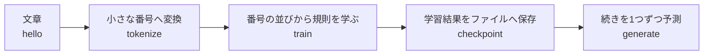
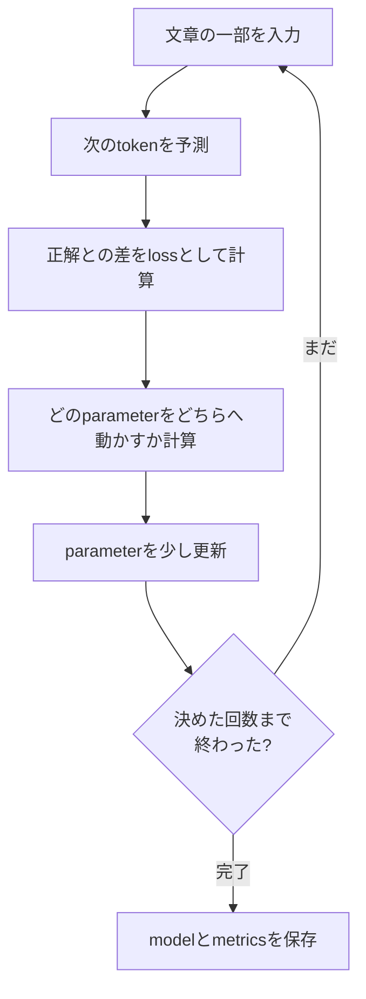
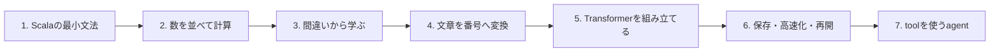
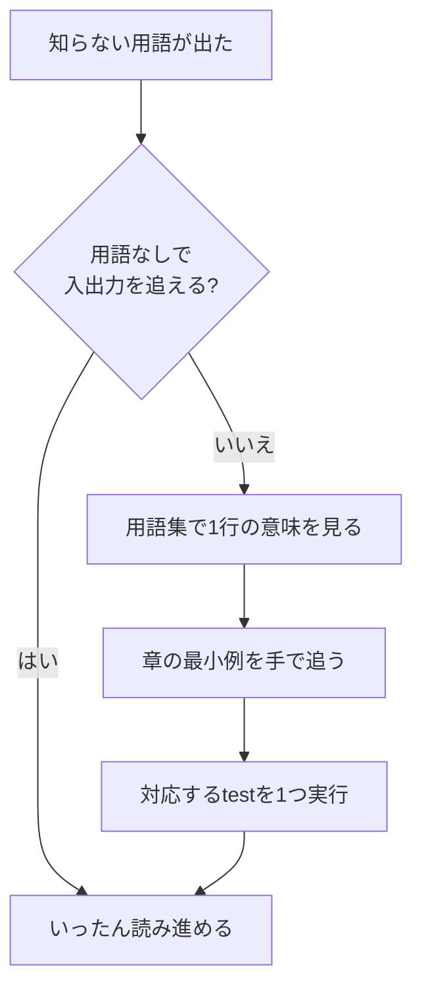

# 図で見る全体像と最小用語集

このページは、専門用語を覚える前に「何を作っているのか」をつかむための地図です。
最初からすべて理解する必要はありません。分からない言葉が出たら戻ってください。

## 本当に必要な前提知識

必要なのは次の3つだけです。

1. ファイルを開いて文字を編集できる。
2. ターミナルへ掲載されたコマンドを貼り付けられる。
3. 足し算・掛け算を見て、分からない箇所を質問できる。

Scala、微分、確率、機械学習の経験は不要です。数式は暗記する対象ではなく、コードが
どの値を計算するかを短く書いたメモとして、その都度読み方から説明します。

## まずこの1本の流れだけを見る

言語モデルは、文章を受け取り、次に来そうな文字や単語の候補へ点数を付けます。

前半は図の箱を左から1つずつ自作します。後半は、同じ箱を速く、安全に、中断から
復旧できるようにします。

## 学習中に起きていること

「訓練」は魔法ではなく、予測の間違いを数値にして、少しだけ設定値を直す反復です。

矢印を追えれば十分です。`gradient` や `optimizer` は、あとで D と E に付ける名前です。

## コースの道順

各箱で「入力」「出力」「失敗する条件」を自分の言葉で説明できたら次へ進みます。

## 最小用語集

| 用語 | このコースでの平易な意味 | 最初に見る章 |
| --- | --- | --- |
| model | 入力から予測を作る、調整可能な計算 | 09、17 |
| token | 文章を計算できるように置き換えた小さな番号 | 14 |
| tokenizer | 文章とtoken列を相互変換する処理 | 14、15 |
| parameter | 学習によって少しずつ変える数値 | 09 |
| loss | 予測が正解からどれだけ外れたかを表す1個の数 | 09 |
| gradient | parameterをどちらへ動かすとlossが減るかという手掛かり | 08、10 |
| optimizer | gradientを使ってparameterを更新する規則 | 13 |
| tensor | 形を持つ数値の並び。表や表の集まり | 12 |
| shape | tensorの各方向に数値がいくつあるか | 06、12 |
| batch | まとめて処理する複数の例 | 16 |
| training | lossを計算し、parameterを繰り返し更新すること | 09、22b |
| inference | parameterを変えず、学習済みmodelで予測すること | 23 |
| checkpoint | modelを後で読み戻すための保存ファイル | 25 |
| context | 1回の予測でmodelが参照できる過去のtoken | 16、19 |
| attention | context内のどのtokenをどれだけ参照するかを計算する仕組み | 19 |
| Transformer | attentionなどを組み合わせたmodelの設計 | 20 |
| update | parameterを1回変更する単位 | 22b |
| validation | 学習に使わない例で、改善が通用するか測ること | 22b |
| seed | 乱数を同じ順序で再現するための開始番号 | 07、16 |
| agent | modelの出力を読み、tool実行や停止を管理するprogram | 33–39 |
| tool | ファイル検索など、modelの外側で実行する機能 | 34 |

用語を知っていること自体は完了条件ではありません。具体的な入力を1つ追えることが
重要です。

## 迷ったときの読み方

まず `./learn-ai foundations`、次に `./learn-ai xor`、その後に
`./learn-ai bigram` を実行すると、計算が段階的につながります。

