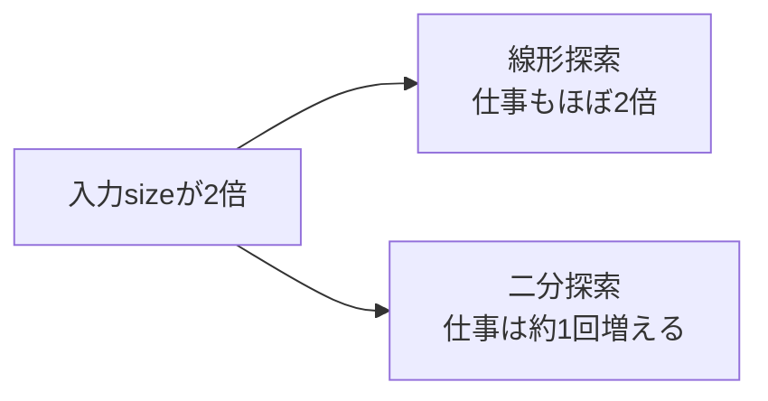

# 03a — 計算量と表現

## この章で作るもの

線形探索、二分探索、行列のrow-major走査、伸長する配列、浮動小数点payloadについて、
決定的なcost実験を作ります。記号の暗記ではなく、benchmarkの前に入力が要求する仕事量と
memoryを予測できることが目的です。

実装と仕様は `src/main/scala/learnai/foundations/Complexity.scala` と
`ComplexitySuite.scala` に並びます。`./learn-ai complexity` で実行します。

## 専門用語より先に問題を見る

同じ答えを返すprogramでも必要な仕事量は異なります。100万個を左から探すと全要素を
見る場合があります。整列済みなら中央を見て候補の半分を捨てられます。また、行列の
全cellを読む2つのloopでも、memory上で隣を順番に読むか飛び飛びに読むかが違います。



1,024個に存在しない値を探すと、線形探索は1,024比較、二分探索は最大11比較です。

## 手計算できる例

`[2, 5, 8, 11, 14, 17, 20, 23]` から `14` を探します。線形探索は5回比較します。
二分探索は中央の`11`、次に`17`、最後に`14`を見て3回です。

2行3列のrow-major行列では `offset = row * columns + column` です。

```text
座標:   (0,0) (0,1) (0,2) (1,0) (1,1) (1,2)
offset:     0     1     2     3     4     5
```

行優先は`0,1,2,3,4,5`、列優先は`0,3,1,4,2,5`です。訪問cellは同じでも順序が違います。

## 用語を平易に読む

- **time complexity**: 入力sizeに対して操作回数がどう増えるか
- **space complexity**: 必要な保存領域がどう増えるか
- **payload**: object headerを除き、値そのものを保存するbyte
- **locality**: 近いmemoryを近い時刻に使う性質
- **allocation**: 新しいobjectやarrayの領域を確保すること
- **amortized**: まれな高costを多数の安い操作へ平均した見方

`O(n)`は仕事量が`n`に比例し、`O(log n)`は入力を何倍かしても少ししか増えないことを
表します。秒数、定数倍、JVM warmup、object overheadまでは表しません。

## Implementation walkthrough

`linearSearch`はindexを左から進め、matchなら即座に返します。比較回数は実際に見たprefix
の長さです。missなら`values.size`になります。

`binarySearch`はinclusiveな`[low, high]`を所有します。中央は
`low + (high - low) / 2`で求め、加算overflowを避けます。比較ごとに候補の少なくとも半分を
捨てます。

`rowMajorOffset`は`Math.multiplyExact`と`Math.addExact`を使います。overflowを黙認すると
正しそうな誤addressになるためです。`traversalOffsets`は正確なindex列を返し、noiseのある
時間測定をcacheの証明には使いません。

`doublingArrayCopies`はcapacity 1から始まり、満杯で2倍にして既存要素をcopyします。
伸長する1回は高costですが、`n`回appendするまでの総copyは`2n`未満です。

`doublePayloadBytes`は要素数を8倍します。JVM arrayにはheaderやalignmentもあるため、これは
payloadだけです。

## Reading tests

`ComplexitySuite`は先頭・末尾・miss、二分探索の対数上限、異なる走査順と同一coverage、
配列伸長の`2n`境界、byte計算の正常・負値・overflowを宣言します。時間のthresholdは
JITや共有machineのnoiseで不安定なためtestしません。

## 実行と観察

```console
$ ./learn-ai complexity
```

表示前に比較回数を予測し、payload byteはどちらの探索でも線形に増えることも確認します。

## Debugging checklist

1. 二分探索が既存値を逃すなら各loopの`low,middle,high`を書く。
2. offsetが違うなら`row * columns + column`を手計算する。
3. byteが負ならexact arithmeticとoverflow拒否を確認する。
4. timingと比較回数が矛盾したらJIT warmupとnoiseを分離する。
5. collection伸長が遅いならloopだけでなくallocationとcopyを見る。

## 限界と次への接続

これはCPU命令、branch prediction、cache階層、SIMD、GC、headerをmodel化しません。03bでJVM
process境界を観察し、後のTensor、attention、KV cache、quantization、distributed章でshape、
byte、通信costへ接続します。

## 演習

1. insertion sortの比較回数を数える。
2. 固定幅伸長と2倍伸長の総copyを比較する。
3. `r × c` Double行列のpayloadを導出する。
4. 二分探索が整列済み入力を必要とする理由を説明する。

## 完了基準

- 線形と対数の比較回数を予測できる。
- row-major offsetを計算できる。
- payloadとJVM overheadを区別できる。
- amortized伸長を総copy上限で説明できる。
- 操作countとbenchmark timingの違いを説明できる。

