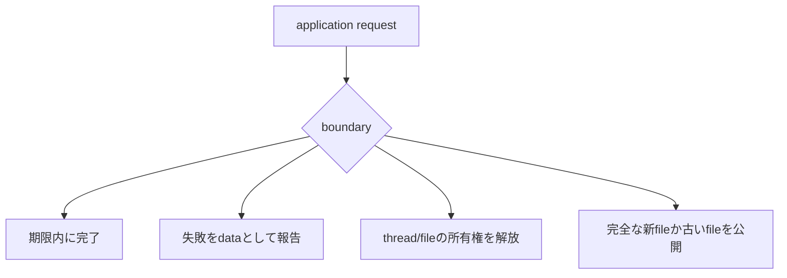
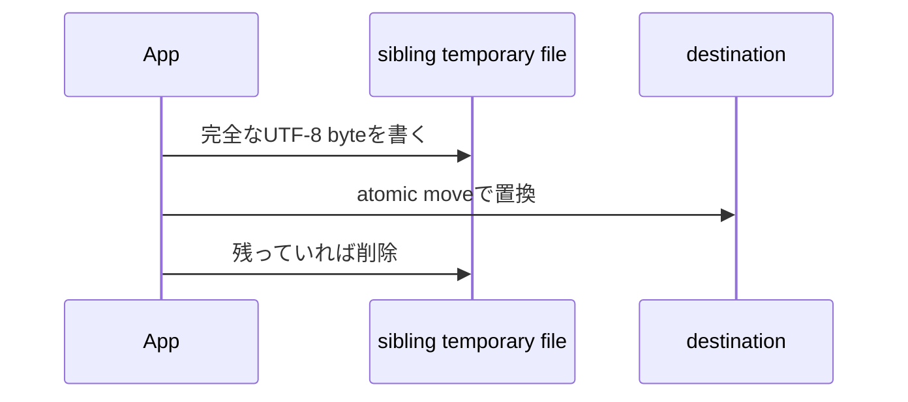

# 03b — JVM systemの境界

## この章で作るもの

JVM capacity snapshot、期限付きwork、UTF-8 fileのatomic replacementという3つの境界を
作ります。後のbenchmark、tool timeout、checkpoint、再現可能な成果物の土台です。
実装とtestは `JvmSystems.scala` と `JvmSystemsSuite.scala` に並び、`./learn-ai jvm`で
実行します。

## 専門用語より先に問題を見る

正しい数式も有限のprocess内で動きます。heapとprocessor数には上限があり、workはhangし、
threadは停止と解放が必要です。fileを直接上書きすると途中状態をreaderが見る可能性が
あります。



## JVM、JIT、heap、GCを平易に読む

ScalaはJVM bytecodeへcompileされます。JVMは現在のmachine向けに実行し、JITは頻繁に
通るpathを観察して最適化します。そのため初回とwarmup後の時間は同じとは限りません。

heapは多くのobjectとarrayを置く領域です。`maxMemory`は要求可能な上限、`totalMemory`は
現在確保済み、`freeMemory`は確保済み領域の空きです。live objectの正確なsizeではなく、
native memory、thread stack、class metadataは別です。

GCは到達不能objectを見つけて領域を再利用します。1回のtimingにGC pauseが重なっても
algorithmの計算量が変わったわけではありません。

## concurrencyより先に所有権を見る

executorを作った側はshutdownを所有し、taskを作った側はcancel policyを所有します。
`runBounded`はworkerを1つ作り、taskを1つsubmitし、期限まで待ちます。

```scala
enum BoundedResult[+A]:
  case Completed(value: A)
  case TimedOut
  case Failed(message: String)
```

timeout、計算失敗、正常値を型で区別します。taskがthrowしても`finally`でexecutorを閉じます。

## atomicなfile公開

destinationへ直接書くと停止時にtruncateされたfileを公開します。代わりに同じdirectoryの
temporary fileへ全部書き、完成後に置換します。



readerは古い完全fileか新しい完全fileを見ます。ただし停電後のdurabilityは別の契約で、
`fsync`などが必要になる場合があります。

## Implementation walkthrough

`snapshot`はprocessor数とheap値、Java identityをraw byteで記録します。観察値であり予約では
ないため、直後に変化し得ます。

`runBounded`は0以下のdeadlineを拒否し、by-name bodyを`Callable`としてsubmitします。
timeoutでは`cancel(true)`でinterruptを要求します。`Thread.sleep`は協調しますが、任意codeは
interruptを無視できます。従ってthread timeoutはsecurity sandboxではありません。

failureはnon-fatal exceptionをdataへ変えます。`finally`で`shutdownNow`し、短時間terminationを
待つことでsuccess pathでもworkerをleakさせません。

`writeUtf8Atomically`はabsolute pathとparentを求め、sibling temporary fileへUTF-8 byteを
書き、`ATOMIC_MOVE`とreplacementで公開します。`Either`はfilesystem exceptionへ操作contextを
加えます。

## Reading tests

snapshot testはprocessor/heapが正、freeが非負、identityが空でないというportableな性質だけを
見ます。bounded testはsuccess、exception、実deadlineを覆います。timeout fixtureにはinterrupt
可能なsleepを使います。atomic write testは2回書いて置換を確認し、日本語の正確なUTF-8 byte数と
最終contentを検証します。

## 実行と観察

```console
$ ./learn-ai jvm
```

maximum heapとallocated heapを比較し、同義語として扱わないでください。2回実行するとidentityは
安定し、allocationは変化する場合があります。bounded taskは`42`を返します。

## Debugging checklist

1. processが終了しないなら全executorとshutdown ownerを探す。
2. timeout後もworkが続くならinterruptを観察するか、副作用があるか確認する。
3. heap値が矛盾して見えたらmaximum、allocated、free allocatedを分ける。
4. partial fileが見えるならsibling temporaryとatomic replacementを確認する。
5. timingがrunごとに変わるならJIT warmupとGC noiseをalgorithm変更から分離する。

## 限界と次への接続

これはprofiler、scheduler、process sandbox、durable databaseではありません。GC event、native
memory、structured concurrency、file lock、network protocol、`fsync`、crash recoveryは扱いません。
後のbenchmarkはruntimeをlabelし、checkpointはatomic公開とchecksumを使い、agentはtimeout、retry、
idempotency、approvalを追加します。

## 演習

1. raw byteを変えずにheapをMiB表示する。
2. interruptを確認するcancel-aware loopを加える。
3. bounded workをmonotonic clockで測る。
4. atomic renameと停電durabilityの違いを説明する。

## 完了基準

- bytecode、JIT warmup、heap、GCを別の仕組みとして説明できる。
- executor、cancel、shutdownの所有者を特定できる。
- completion、timeout、failureを型で区別できる。
- sibling temporary fileがpartial公開を防ぐ理由を説明できる。
- thread interruptionがsecurity sandboxではない理由を述べられる。

