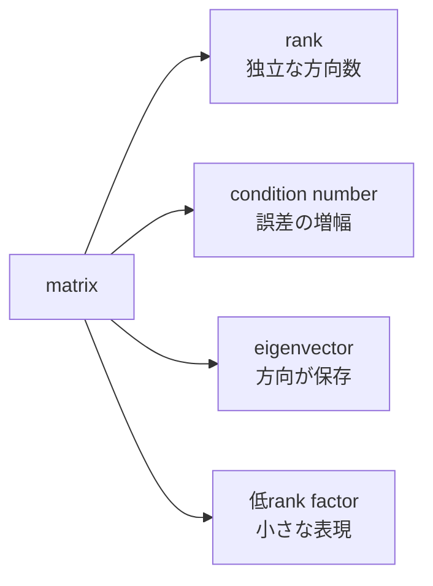

# 08a — rank、condition、eigen、低rank構造

## この章で作るもの

数値rank、dominant eigenvector、2×2のsingular value、outer productを実装します。行数が
多くても情報が重複する理由、小さな誤差が増幅される理由、LoRAが狭いfactorで大きな更新を
表現できる理由へつながります。`LinearAlgebra.scala`と`LinearAlgebraSuite.scala`が並び、
`./learn-ai linear-algebra`で実行します。

## 専門用語より先に問題を見る

matrixは同じ情報を繰り返し、invertibleでもrounding noiseを大きく増幅する場合があります。
繰り返し乗算すると最も強く伸びる方向が現れ、大きな表を少数のouter productで表せる場合も
あります。



## 手計算できる例

`[1,2]`と`[2,4]`は同じ方向です。2行目から1行目の2倍を引くとzero rowなのでrank 1です。
`diag(4,2)`のeigenvalueとsingular valueは4と2、condition numberは2です。

`[1,2]`と`[3,4,5]`のouter productは`[[3,4,5],[6,8,10]]`です。全rowが倍数なので
6値を持ってもrank 1です。

## 用語とshape

- **rank**: 独立なrow/column方向の数
- **eigenvector**: square matrixを掛けても方向が変わらない非zero vector
- **eigenvalue**: その方向へ掛かる倍率
- **singular value**: 入力と出力の対応方向における非負の強さ
- **condition number**: 最大singular value / 最小singular value
- **residual**: 近似結果が式からどれだけ外れるか
- **low rank**: 見かけのdimensionより少ない独立方向で表せること

## Implementation walkthrough

`rank`はimmutable matrixを作業arrayへcopyし、各columnで絶対値最大のpivotを選びます。
partial pivotingにより不要に小さい値で割ることを避けます。pivotがtoleranceより大きければ
下をeliminateし、採用pivot数をrankにします。toleranceは答えの一部です。

`dominantEigenpair`は初期vectorをnormalizeし、matrix乗算とnormalizeを反復します。
Rayleigh quotient `vᵀAv`でeigenvalueを求め、`||Av-λv||`をresidualとしてconvergenceを
評価します。

`singularValues2x2`は`AᵀA`を作り、2×2 characteristic polynomialのclosed formから
eigenvalueを求め、その平方根を返します。`conditionNumber2x2`は最小値がtolerance以下なら
巨大な有限値を作らずerrorにします。

`outer`は各cellで`left(row)*right(column)`を計算します。`r`個のouter productの和はrank
最大`r`で、factorized updateのstorageと表現力のtradeoffになります。

## Reading tests

identity、duplicate row、zero rectangular matrixのrankを手計算で検証します。power iterationは
`[[3,1],[1,3]]`を使い、dominant value 4、unit norm、小residualを要求します。diagonal matrixが
singular valueの独立oracleです。rank deficient matrixはcondition errorを返し、outer productは
全cellとrank 1を確認します。

## 実行と観察

```console
$ ./learn-ai linear-algebra
```

rank、dominant value、conditionを先に予測してください。表示桁数ではなくresidualが式を満たす
証拠です。

## Debugging checklist

1. rankが変ならpivot magnitudeとtoleranceを表示する。
2. non-finiteならdivision前に最大pivotを選んだか確認する。
3. power iterationが止まるならdominant magnitudeのtieと初期方向を見る。
4. conditionが巨大なら比較toleranceではなく最小singular valueを見る。
5. 低rank再構成のshapeが違うならfactor shapeを先に書く。

## 限界と次への接続

SVDは2×2限定で、productionではstableなiterative factorizationとconvergence reportが必要です。
rankはscale-aware toleranceを要し、この実装はabsolute toleranceです。power iterationは1方向だけを
求めます。後のLoRA、precision、scaling diagnosis、gradientへ接続します。

## 演習

1. matrixを100万倍してrelative rank toleranceを設計する。
2. eigenvalue gapとresidual収束を比較する。
3. outer productを2つ足しrank 1と2の例を作る。
4. `AᵀA`がconditionを悪化させる理由を説明する。

## 完了基準

- eliminationでrankを求められる。
- eigenvalue、singular value、conditionを区別できる。
- residualで近似eigenpairを評価できる。
- outer productのshapeとrank上限を導出できる。
- reference algorithmの数値的限界を述べられる。

