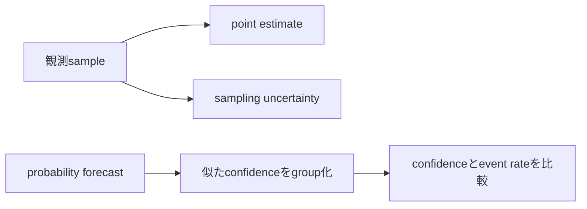

# 08b — 推定、不確実性、calibration

## この章で作るもの

sample mean、不偏sample variance、meanのconfidence interval、probability forecastの
reliability bin、expected calibration errorを作ります。1つの平均値だけでなく、どの程度の
不確実性を伴う主張なのかを示します。実装とtestは`Statistics.scala`と
`StatisticsSuite.scala`に並び、`./learn-ai statistics`で実行します。

## 専門用語より先に問題を見る

2つの評価がaccuracy `0.80`でも、一方が5例、他方が5万例なら証拠の強さは違います。
また「80%」と予測するmodelは、似たcaseの約80%で正しい必要があります。accuracyだけでは
probabilityの意味が正しいか分かりません。



## 手計算できる例

`[1,2,3]`のmeanは2、deviationは`[-1,0,1]`、平方和は2です。不偏varianceは`n-1`で割るため
1、meanのstandard errorは`1/sqrt(3)`です。簡単のため`z=2`ならintervalは
`2 ± 2/sqrt(3)`です。

これはnormal approximationです。計算後のtrue meanが95%の確率で中にあるという意味では
なく、仮定の下でsample取得を繰り返すprocedureが長期的に所定の割合でtrue meanを含みます。

## 用語を平易に読む

- **population**: 主張したいcase全体
- **sample**: 実際に観測したcase
- **estimator**: sampleからestimateを作る規則
- **bias**: estimatorが系統的にtargetからずれること
- **variance**: sampleを取り直したときestimateが変動する程度
- **standard error**: 個々の値ではなくestimatorのばらつき
- **confidence interval**: 繰り返しsamplingでcoverageを持つinterval procedure
- **calibration**: stated probabilityと観測頻度の一致
- **binning**: 近いpredictionをまとめて頻度を観測すること

## 数式とcode

`sampleMean`は`x̄ = Σxᵢ/n`、`sampleVariance`は
`s² = Σ(xᵢ-x̄)²/(n-1)`を計算します。`meanConfidenceInterval`は
`SE=s/sqrt(n)`と`x̄ ± z SE`を返します。

各calibration binはcount、mean prediction `p_b`、event rate `y_b`を持ち、ECEは
`Σ (n_b/n)|p_b-y_b|`です。

## Implementation walkthrough

`sampleMean`はemptyを拒否し、compensated sumを使います。`sampleVariance`は2値以上を要求し、
同じsampleでmeanを推定したbiasを`n-1`で補正します。

`meanConfidenceInterval`は正でfiniteなcritical valueを検証し、mean、standard error、bounds、
sample countを`MeanEstimate`へまとめます。boundsだけが証拠sizeから切り離されません。

`ProbabilityForecast`はprobability rangeとbinary outcomeをconstructorで検証します。
`reliability`は`p=1`を最後のbinへclampし、empty binは架空rateを作らず省略します。

ECEは各gapをforecast全体に占めるcountでweightします。binを単純平均すると1例binと1万例binを
同じ重さにしてしまいます。empty forecastはdenominatorがないためerrorです。

## Reading tests

`[1,2,3]`でmeanとvarianceを独立に手計算します。intervalは`z=2`を指定し、standard error、
左右対称、sample countを確認します。empty mean、1値variance、invalid zも拒否します。

probability 0でoutcome 0、probability 1でoutcome 1ならECE zeroです。別testは2つのoccupied binと
2つのempty binを作り、empty省略、weighted ECE、empty forecast拒否を検証します。

## 実行と観察

```console
$ ./learn-ai statistics
```

`1..5`のmeanを先に計算し、interval widthがzeroか予測してください。単一ECEだけでなく各binを
見て、どのconfidence領域がずれているか確認します。

## Debugging checklist

1. varianceが小さすぎるならdenominator `n`と`n-1`を確認する。
2. noise増加でintervalが狭まるならstandard deviationとsample countを分ける。
3. probability 1でcrashするなら最後のbinへclampする。
4. bin countでECEが激変するなら各bin countとsparsityを見る。
5. 精密に見える評価でもindependenceとrepresentativenessを確認する。

## 限界と次への接続

intervalはnormal approximationです。小さな非normal sampleにはStudent-tやbootstrapが必要です。
correlation、dataset shift、multiple comparison、causal claimは扱いません。ECEはbin境界に依存し、
sparse領域を隠せるためcalibration plotやproper scoring ruleも必要です。

後のscaling experimentはfitのuncertaintyを使い、model/safety evaluationはsliceと反復trialを
扱います。failureを観測しなかったことを安全の証明にはしません。

## 演習

1. small sample向けStudent-t critical valueを追加する。
2. seeded bootstrap intervalを実装する。
3. Brier scoreを追加しcalibrationとdiscriminationを区別する。
4. named sliceごとにforecastを分け、小sliceのfailureを隠さない。

## 完了基準

- mean、不偏variance、standard errorを手計算できる。
- confidence intervalをrepeated-sampling procedureとして解釈できる。
- individual spreadとestimator uncertaintyを区別できる。
- reliability tableとweighted ECEを作れる。
- summaryの前にassumptionとbinning limitationを述べられる。

