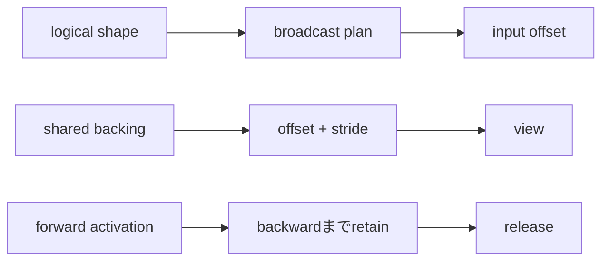

# Tensor execution model：shapeだけでは足りない

## まず何が問題なのか

tensorを「shapeを持つ配列」と覚えるだけでは、実行時の重要な問いが残ります。異なるshapeを
組み合わせるとき何を繰り返すのか、batch内のexampleは混ざらないか、transposeはcopyなのか、
backwardまでどの中間値をmemoryに残すのか、という問いです。

Chapter 12の`Tensor`は意図的にimplicit broadcastingを禁止しています。本章はその安全境界を
壊さず、`BroadcastPlan`、`StridedView`、`BatchedMatmul`、`GraphLifetime`を独立した実行modelとして
追加します。

```bash
./learn-ai tensor-execution
```



## broadcastingを手で追う

`[2,1]`の`[[10],[20]]`と、`[1,3]`の`[[1,2,3]]`を足します。axisは右から揃え、同じdimensionは
そのまま、1は繰り返せます。outputは`[2,3]`です。

```text
left offset   0 0 0 1 1 1
right offset  0 1 2 0 1 2
result       11 12 13 21 22 23
```

inputを6要素へcopyする必要はありません。backwardでは繰り返しを加算で戻します。upstreamが
`[1,2,3,4,5,6]`ならleft gradientは`[6,15]`、right gradientは`[5,7,9]`です。このreduceを
忘れるとforwardだけ正しくgradientが壊れます。

`[2,3]`と`[2,4]`は最後のaxisが異なり、どちらも1ではないため拒否します。numerical loopへ
入る前にplan作成で失敗させます。

## batchはexampleを隔離する契約

batched matmulは`[B,M,K] × [B,K,N] -> [B,M,N]`です。batch indexごとに別のmatrix pairを選び、
dot productは`K`だけをreduceします。reference testは`[1,2]·[3,4]=11`と
`[10,20]·[5,6]=170`を同時に計算し、batch間が混ざらないことを確認します。

現在の`BatchedMatmul`はdense forward referenceで、autodiffからdetachしたconstantを返します。
backward、broadcast batch、高rank、BLAS/GPU dispatchは未実装です。これはproduction互換を
装わないための明示的制限です。

## viewは値でなくaddressingを変える

contiguousな`[2,3]`はstride `[3,1]`です。transposeはshapeを`[3,2]`、strideを`[1,3]`へ
入れ替えるだけでbacking vectorを共有できます。

```text
backing: 1 2 3 4 5 6
view:    1 4
         2 5
         3 6
```

`materialize`を呼んだ時だけ`[1,4,2,5,3,6]`をcopyします。任意strideを読めるkernelもあれば、
contiguous inputを要求するkernelもあります。現在はimmutable backingなのでmutable view同士の
alias問題を避けています。production autodiffにはmutation ruleやversion counterが必要です。

## graph lifetimeとmemory

reverse-mode autodiffはforward後にbackwardします。backward formulaがinput、output、mask、統計を
必要とするため、activationを保持します。`GraphLifetime.retain`は`shape.size × bytesPerElement`を
checked arithmeticで合計し、`release`後に使用byteを0とします。二重releaseはprogramming errorです。

これはgarbage collectorではなくaccounting modelです。実際の`Tensor` objectはJVM reachabilityで
管理されます。production engineはreference count、eager free、activation checkpoint、recomputeを
使います。本章はpolicyの前にownershipを見えるようにします。

## Implementation walkthrough

1. `BroadcastPlan.between`がleading 1を補い、axis compatibilityとoutput shapeを決めます。
2. output flat indexから左右input offsetを作り、`map`はexpanded copyなしで計算します。
3. `reduceGradient`は同じinput offsetへ来たgradientを加算します。
4. `StridedView.contiguous`がrow-major strideを作り、`transpose`はmetadataだけ交換します。
5. `BatchedMatmul`はflat indexをbatch/row/columnへ戻し、inner axisだけをreduceします。
6. `GraphLifetime`がactivation byteとrelease stateを所有します。

`TensorExecutionSuite`は既知broadcast値、gradient reduction、不正shape、backing identity、batch隔離、
lifetime transitionを宣言的にtestします。

## Reading the tests

最初のtestのoffset表を紙に書いてから実行してください。次にbackward testの各和を確認します。
view testは値が同じだけでなくScalaの`eq`で同じbacking objectだと証明します。batch testは桁を
大きく変え、cross-batch混入を見つけやすくしています。最後にordinary releaseとdouble releaseの
failure pathを読みます。

```bash
./learn-ai test
```

full suiteはChapter 12の「implicit broadcastをしない」というcontractも維持します。

## Debugging checklist

- dimensionは左でなく右から揃える。
- 足りないleading axisは1として扱う。
- 異なり、どちらも1でないaxisは拒否する。
- backwardは同じinput offsetへmappedされたgradientを全て足す。
- batch indexをdot productのreduceへ混ぜない。
- transposeがviewかcopyかをmemory計算前に確認する。
- kernelがarbitrary strideを読めると仮定しない。
- parameterだけでなくsaved activationをbackwardまで数える。
- consumerが残るgraphをreleaseしない。
- JVM objectとaccelerator bufferのownershipを区別する。

## 制限と次

これはcorrectness modelでありhigh-performance runtimeではありません。broadcastはautodiff Tensor
operatorへ未統合、batched matmulはforwardのみ、viewはimmutable transpose中心、lifetimeは実storageを
解放しません。次段階ではstorage object、view-aware gradient、alias analysis、graph freeing、benchmarkが
必要です。次章では「どの値をいつ保持するか」の次に、「何bitで保存・加算するか」を扱います。
