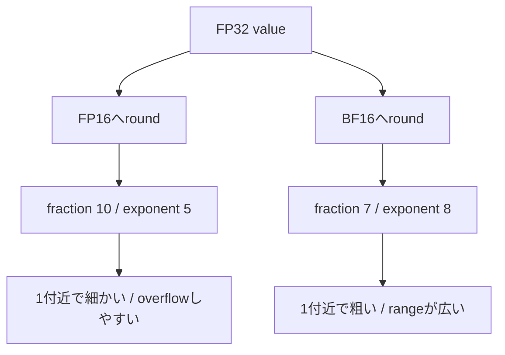
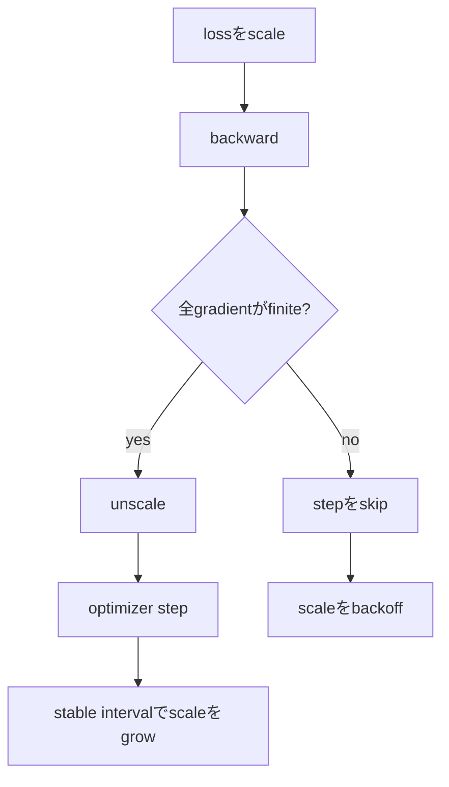

# Precision engineering：storage、accumulation、loss scaling

## まず何が問題なのか

computerは多くの実数をexactに保存できません。neural networkではmemory trafficを減らすため
16-bitで保存し、重要なreductionは32-bitで行うことがあります。mixed precisionは一つのdtypeでは
なく、storage、compute、accumulation、overflow detection、optimizer updateのpolicyです。

本章は`FloatFormat`、`Accumulation`、`DynamicLossScaler`を実装します。

```bash
./learn-ai precision
```

## 同じ16 bitでも配分が違う

| format | sign | exponent | fraction | 特徴 |
| --- | ---: | ---: | ---: | --- |
| FP32 | 1 | 8 | 23 | baseline compute/accumulation |
| FP16 | 1 | 5 | 10 | 近い値を細かく表すがrangeが狭い |
| BF16 | 1 | 8 | 7 | rangeはFP32に近いが粗い |



`1.001`付近ではFP16 errorがBF16より小さく、`100000`ではFP16がinfinity、BF16がfiniteです。
従って「どちらが正確か」は値の分布とoperationに依存します。

`BFloat16Codec`はround-to-nearest-evenを実装します。FP32上位16 bitを残し、捨てる下位bitで
incrementを決めます。exact halfwayでは残る最下位bitがevenになる側を選びます。NaN/infinityは
finite値と同じroundを行いません。

## storage precisionとaccumulation precisionは別

数学では`100000000 + 1 - 100000000 = 1`です。しかしFP32で左から足すと、1がspacingより小さく
消え、結果は0になります。FP64 accumulatorならこの例の1を保持します。

pairwise reductionは長いchainでなくtreeで足し、近いscaleの値を早く組み合わせてerror growthを
減らすことがあります。ただしcorrectly rounded exact sumを保証しません。GPU matmulはlower-precision
operandを読みFP32で積をaccumulateすることがあります。input dtypeだけではnumerical behaviorを
説明できません。

parallel reductionはthread、partition、kernelによってtreeが変わります。rounded arithmeticでは
associativityが成立しないため、bitwise replayが必要ならreduction orderを固定します。

## lossをscaleする理由

backpropagationでは小さいgradientがFP16でzeroへunderflowすることがあります。scalar lossを`S`倍すると
chain ruleで全gradientが`S`倍されます。optimizer前に同じ`S`で割ります。

$$
\nabla_\theta (S L) / S = \nabla_\theta L.
$$

scaleが大きすぎるとoverflowします。dynamic loss scalingはoverflowをcontrol flowとして扱います。



infinityをzeroへ置換してstepするとoptimization problemを変えてしまいます。
`DynamicLossScaler.unscale`はexplicitな`skipped`、empty gradient、backoff後stateを返します。callerは
optimizerを所有し、このflagを守る必要があります。

## 小さいtrace

scale 1024、growth interval 2から始めます。scaled gradient `[1024,-2048]`は`[1,-2]`になります。
1回目はscale 1024のままstable counterが1、2回目のfinite stepでscale 2048、counter 0になります。
infinityが出ればstepをskipし、defaultではscaleを0.5倍しcounterをresetします。

本実装はscaleを最低1にします。production frameworkはinitial scale、growth/backoff、interval、
hysteresis、device間overflow aggregation、checkpointed scaler stateなどを持ちます。

## Implementation walkthrough

1. `FloatFormat.round`はDoubleを実際のFP32/FP16/BF16 representationへ通して戻します。
2. `BFloat16Codec.bits`はspecial exponentを分け、`0x7fff + retainedLSB`でroundします。
3. `Accumulation.naiveFloat32`は各addition後にroundし、`float64`はwide referenceです。
4. `pairwiseFloat32`はbalanced reduction treeを固定します。
5. `DynamicLossScaler`はpolicyをconstructorで検証し、finiteならunscaleとgrowth、non-finiteならskipと
   backoffを返します。
6. `LossScaleResult`がgradient、next state、skip decisionを一つのvalueにします。

courseのTensorはDouble storageなので、これはrepresentation/control semanticsのmodelです。現在の
Tensor operationを高速化した、またはmemoryを半減したとは主張しません。

## Reading the tests

最初は全formatでexactな値を使います。次は`1.001`と`100000`でlocal precisionとrangeを分離します。
tie testはdecimal parserに依存せずraw FP32 bitsを作ります。cancellation testは手計算oracleを持ちます。
scaler testはfinite growth、overflow skip/backoff、不正policyを宣言します。

```bash
./learn-ai test
```

real trainingではformatだけでなくloss-scale history、skipped step数、unscale前後gradient norm、reduction
実装も記録する必要があります。

## Debugging checklist

- storage、multiply、accumulation formatを別々に書く。
- underflowとoverflowの両方を確認する。
- decimal桁数でなく実際のmagnitude付近のspacingを見る。
- clippingとoptimizer stepより前にunscaleする。
- 全parameter・全distributed rankのnon-finiteを集約する。
- overflow時はcoordinated update全体をskipする。
- exact resumeにはscaler stateもcheckpointする。
- bitwise reproducibilityにはreduction orderを固定する。
- pairwise sumをexact sumの証明と誤解しない。
- speed/memory改善はbenchmarkしてから主張する。

## 制限とproduction境界

CPU上のformat modelであり、FP16/BF16 Tensor storage、vectorized kernel、tensor core、stochastic rounding、
FP32 master weight、distributed overflow collective、optimizer integrationはありません。pairwise recursionも
tuned kernelではありません。

production mixed-precision trainerはoperation別autocast、sensitive reduction/optimizer stateのprecision、
rank間overflow decision、scaler checkpoint、高precision baselineとのconvergence比較を定義する必要が
あります。本章はformat conversionだけでfast trainerになったように見せず、そのcontractを分解します。
