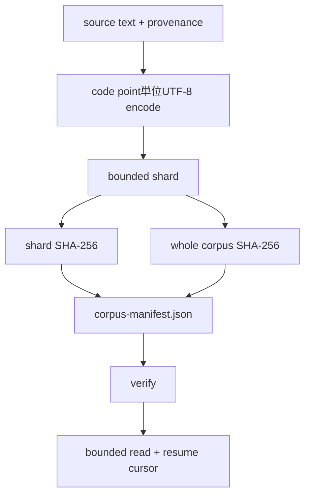

# Corpus manifestとshard：modelが読んだbyteを特定する

## まず何が問題なのか

一つのtext fileでlossを下げるだけでは、再現・監査に必要な問いが残ります。sourceとlicenseは何か、
昨日と同じbyteか、memoryより大きいcorpusをboundedに読めるか、中断後のexact next byteから再開
できるか、missing/truncated/corrupted shardをtraining前に検出できるか、という問いです。

manifestはidentity/provenanceを、shardはpayload分割を担当します。両者は一つのcontractです。

```bash
./learn-ai corpus-shards
```



## artifact set

directoryには`corpus-manifest.json`と`shard-00000.bin`などがあります。`CorpusShard`はrelative name、
global `startByte`、positive `byteLength`、SHA-256を持ちます。first startは0、次のstartは前のexclusive
end、last endは`totalBytes`でなければなりません。

`CorpusShardManifest`はschema version、name、whole SHA-256、`CorpusProvenance`も持ちます。provenanceは
source、declared license、collection instantです。これはownerが供給するclaimです。hashはbyte identityを
証明しますが、source claimの正直さやlegal permissionを証明しません。

## shardとwholeの両方をhashする理由

per-shard digestは壊れたphysical pieceを特定します。concatenated corpus digestはordered logical corpusを
同定します。個々にvalidなshardをwrong orderに並べる問題には、ordered manifestとwhole digestが必要です。

verifyは各fileを8192-byte bufferでstreamし、shard digestとwhole digestを同時更新します。
`readAllBytes`を使わないため、shard sizeから独立したbounded memoryです。lengthを先に検査し、truncateは
length error、同じlengthのbit flipはSHA mismatchになります。

## UTF-8-safe boundary

UTF-8 code pointは1–4 byteです。arbitrary byteでsplitするとemojiの前半とcontinuation byteが別shardに
なります。concatすれば戻っても、individual shardをdecodeできません。

builderはcode pointごとにencodeし、完全なunitがfitする時だけcurrent shardへ入れます。fitしなければ
new shardを始めます。maximumが一code pointより小さい、例えば4-byte rocketに3-byte limitなら拒否します。

`a日🚀b`を4-byte limitで分けるとbyte長は1、3、4、1で、start `[0,4,8]`の3 shardになります。

## bounded readとexact resume

`CorpusCursor(shardIndex, offsetInShard)`はnext unread byteです。`read(cursor, maximumBytes)`はbudget以下を
返し、boundaryをまたげます。結果はbytes、next cursor、`endOfCorpus`を持ちます。

```text
(0,0) -> "ab" -> (0,2)
(0,2) -> "cd" -> (1,1)
(1,1) -> "ef" -> (2,0)
...
(2,2) -> "ij" -> (4,0), end
```

全chunkをconcatするとgap/duplicateなしでoriginalになります。training checkpointにcursorを保存すれば
resumeできますが、同じmanifest identityにもbindしなければなりません。corpus変更後の`(1,1)`は別byteを
指す可能性があります。

## atomic publication

shardとmanifestはtarget directory内temporary fileへ書き、atomic replaceを試します。platformが非対応なら
same-filesystem replaceへfallbackします。manifestはpayloadの後にpublishするため、ordinary single-writerで
new manifestがmissing shardを指すwindowを避けます。

ただしmulti-process transactionではありません。同じdirectoryへのconcurrent builderはraceし、stale shardも
消しません。productionではfresh immutable version directoryを作り、verify後に小さいcatalog pointerを更新します。

## Implementation walkthrough

1. `CorpusProvenance`、`CorpusShard`、`CorpusShardManifest`がconstructorでformatとintervalを検証します。
2. `json`はstable field orderでschema-one artifactをrenderします。
3. builderがcode pointをpackし、atomic write、per-shard/whole digest、manifest publishを行います。
4. readerの`verify`がexistence、length、streaming digest、whole digestを検査します。
5. `read`はcursorを検証し、seekable channelをexact offsetから開き、budget以内でboundaryを進めます。
6. labはtemporary multilingual corpusのidentity、layout、verify、5-byte readを表示します。

## Reading the tests

`CorpusShardsSuite`は各physical shardのstrict UTF-8、global start、別directoryでのdeterministic manifest、
2-byteずつのexact reconstructionをtestします。別caseでone-bit corruption、truncate、delete、invalid cursor、
emojiより小さいlimitを検証します。

```bash
./learn-ai test
```

resume testは各returned chunkがbudget以下であることも確認します。corruption fixtureはlength failureとhash
failureを区別します。

## Debugging checklist

- decoded/reformatted textでなくexact byteをhashする。
- licenseを推測せずaccountable ownerのprovenanceを記録する。
- relative shard name formatを検証しpath traversalを防ぐ。
- ordered intervalがcontiguousでtotalをcoverすることを確認する。
- individual decodeが必要ならcomplete UTF-8 code point間でsplitする。
- shard全体をmemoryへloadせずfixed bufferでverifyする。
- digest前にlengthを確認しtruncation evidenceを明確にする。
- resume cursorをsame manifest identityへbindする。
- referenceするmanifestより先にpayloadをpublishする。
- atomic renameをdistributed transactionと誤解しない。

## 制限とproduction境界

builder inputはin-memory textです。large source builderにはstream inputとbuffer間のincomplete UTF-8 handlingが
必要です。typed manifestを生成しJSONを書きますがpublic manifest parser/migrationはまだありません。readはverify
済みを前提にし、unexpected filesystem failureはthrowします。compression、encryption、object-store retry、writer
lock、stale cleanup、filter、legal policy engineもありません。

次はschema parser、training bundleへのmanifest identity、streaming ingestion、content-addressed directory、conditional
publication、record index、metricsが必要です。現在のcore guaranteeは、exact training byteを名指しし、bounded memoryで
verifyし、explicit next-byte positionからresumeできることです。
