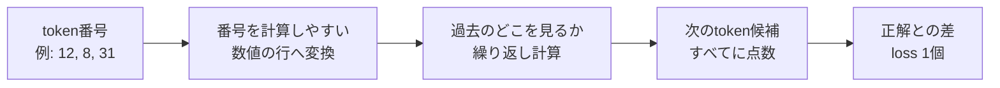

# 21 — MiniGPT で訓練し生成する

## この章で作るもの

埋め込み (embedding)、Transformer ブロック、最終 RMSNorm、共有された出力射影、
交差エントロピーを組み合わせて、end-to-end で訓練でき、自己回帰的に生成できる
デコーダのみの言語モデルを作ります。

ソース: `src/main/scala/learnai/transformer/MiniGpt.scala`。

## アーキテクチャ

ここでは専門名を一度脇に置き、値の流れだけを見ます。「番号の列」を受け取り、各位置で
「次に来る番号の候補」へ点数を付け、正解との差を1個の数にします。



コード上の専門名とshapeを対応させると次のようになります。

```text
token IDs [T] -> embeddings [T,C] -> Transformer x L [T,C]
              -> RMSNorm [T,C] -> logits [T,V] -> loss scalar
```

- `T`: 今回読ませるtokenの個数
- `C`: 各tokenを表すために使う数値の個数
- `V`: 選択肢になり得るtokenの総数
- `L`: 同じ種類の処理を積み重ねる回数

`MiniGptConfig` がすべてのパラメータと活性化の形状を決定します。

| フィールド | 意味 |
| --- | --- |
| `vocabularySize` $V$ | トークナイザのカテゴリ数 |
| `maximumContextLength` $T_{max}$ | 位置テーブルの大きさと入力の上限 |
| `channels` $C$ | トークンあたりの隠れ幅 |
| `headCount` $H$ | $C$ を分割する attention のヘッド数 |
| `hiddenChannels` $F$ | FFN の拡大幅 |
| `layerCount` $L$ | Transformer の深さ |

設定、トークナイザ、チェックポイントは 1 つの互換性契約を形成します。

## 最終正規化

pre-norm のブロックでは、最終的な残差 (residual) ストリームがサブレイヤー後の
正規化の外側に残ります。語彙への射影の前に正規化します。

$$
H_{final}=\operatorname{RMSNorm}(H_L)
$$

最終正規化の有無と種類は、チェックポイントのアーキテクチャの一部です。

## 重み共有

トークンテーブルは $E\in\mathbb{R}^{V\times C}$ です。別の出力行列を確保する
代わりに、その転置を使います。

$$
Z=H_{final}E^{\mathsf T}
$$

利点:

- さらに $CV$ 個のパラメータを削減できる
- 入力と出力のトークン空間を共有できる
- 埋め込みの重みが、参照 (lookup) 経路とロジット経路の両方から勾配 (gradient)
  を受け取れる

`parameters` は共有された Tensor を 1 回だけ含むため、オプティマイザが同じ
ものを二重に更新することはありません。

## 次トークン損失

```text
inputs:  [x0,x1,x2,x3]
targets: [x1,x2,x3,x4]
```

因果マスク (causal mask) により、ロジットの各行はそのプレフィックスにのみ
依存することが保証されます。平均交差エントロピーは 1 つのスカラーを生み、
その逆伝播は埋め込み、すべてのブロック、最終正規化に到達します。

## end-to-end のステップ

```scala
val loss = model.loss(inputs, targets)
loss.backward()
optimizer.step(model.parameters)
```

これらの行は、ここまでに構築したすべてを呼び出します。BPE の ID、埋め込みの
gather、位置の加算、RMSNorm、Q/K/V の射影、causal attention、残差、FFN、共有
ロジット、安定化された交差エントロピー、Tensor のリバースモード、
クリッピング、そして AdamW です。

end-to-end の損失 (loss) が下がることは、個別演算に焦点を当てたテストの
代わりにはなりません。それが検証するのは、統合と訓練可能性です。

## 自己回帰生成

プロンプトを処理し、ロジットの最終行だけを取り出し、トークンを 1 つ
サンプリングして追加し、これを繰り返します。


このリファレンス実装は、ステップごとに過去の Q/K/V をすべて再計算します。
後の章の KV キャッシュは過去のキーとバリューを保存し、新しい位置だけを計算
します。

## スライディングコンテキスト

生成がコンテキスト上限を超えたら、最新のトークンだけを保持します。

```scala
val retained = context.takeRight(maximumContextLength)
```

保持されたウィンドウでは、絶対位置 ID がゼロから振り直されます。訓練でも
同じ規約を使わなければなりません。切り捨てられた情報にモデルはアクセスできま
せん。

## デモが証明すること

このデモは、短い繰り返し系列に意図的に過学習させます。証明されるのは次の
ことです。

- グラフが接続されている
- パラメータが更新される
- モデルが目的関数を減少させられる
- 生成が実行できる

汎化、知識、指示追従、安全性は証明されません。それらには多様なデータ、
ホールドアウト評価、汚染チェック、人手やタスクによる評価が必要です。

## 実行する

```console
$ nix develop -c sbt 'runMain learnai.transformer.trainMiniGpt'
```

この標準ライブラリのみの CPU エンジンは意図的に小さく作られています。設定を
大きくする前にプロファイルを取ってください。

## フロンティアモデルとの関係

共通する原理:

- 自己回帰的な次トークン目的関数
- 埋め込み、causal attention、FFN、残差、正規化
- ロジット、交差エントロピー、AdamW
- 温度サンプリング

まだ欠けているもの:

- バッチ化された GPU カーネルと分散カーネル
- 混合精度と損失スケーリング
- RoPE、GQA、SwiGLU、MoE
- 学習率スケジュールと本番向けチェックポイント
- KV キャッシュ、量子化サービング、リクエストスケジューリング
- 大規模データキュレーションとポストトレーニング

後の章では、この同じ計算を別の原理で置き換えるのではなく、スケールさせたり
洗練させたりしていきます。

## 実装ウォークスルー

`MiniGpt.random` は所有権のルートです。1 つの `SplittableRandom` が、トークン
埋め込みと位置埋め込み、インデックス順の各 Transformer ブロック、最終
RMSNorm を初期化します。ラベルには `blocks.0.attention.query` のような所有権
パスが含まれます。後の章のチェックポイントローダーは、安定したパラメータ順序
とラベルを構造の証拠として利用します。

`logits` が意図的に短いのは、これまでに作った型がそれぞれの不変条件を所有
しているからです。

```scala
val embedded = embeddings(tokenIds)
val hidden = blocks.foldLeft(embedded)((current, block) => block(current))
val normalized = finalNorm(hidden)
normalized.matmul(embeddings.tokens.weight.transpose2D)
```

具体的な設定 `V=5`、`T=3`、`C=4`、`L=1` で形状を追ってみましょう。

```text
token IDs                 [3]
embedding                 [3,4]
one block                 [3,4]
final norm                [3,4]
token table transpose     [4,5]
logits                    [3,5]
targets                   [3]
cross entropy             scalar
```

`loss` は `logits` を呼ぶ前に、ターゲットの長さとすべてのターゲット語彙 ID を
検証します。続いて `Tensor.crossEntropy` は、安定な log-sum-exp の順伝播と
`(softmax-oneHot)/T` の逆伝播を融合して実行します。融合により大きな one-hot
のグラフを構築せずに済みますが、厳密な導関数は Tensor 内に文書化されたまま
保たれます。

`parameters` は、埋め込み、すべてのブロックのパラメータ、最終正規化を連結
します。出力ヘッドはトークンテーブルの転置を再利用するため、パラメータを追加
しません。`distinct` のテストは、この共有 Tensor が 1 回だけ返されることを
保証します。

`MiniGptTrainer.trainSequence` は、モーメントがステップをまたいで維持される
よう AdamW を 1 回だけ作成しますが、損失は反復ごとに新しく構築します。損失は
逆伝播と更新の前に記録され、第 9 章の軌跡の規約と一致します。勾配
クリッピングはノルム 1 で有効化されています。

リファレンスの生成処理は、コンテキストを切り詰め、`logits` を実行し、最終行を
選択し、温度スケーリングの後に softmax を適用し、サンプリングして追加します。
キャッシュ版の生成に対する正しさのオラクルとして使えるよう、意図的に単純に
保たれています。

## テストの読み方

ロジットの形状と値が有限であることの確認により、順伝播のパス全体を検証
します。パラメータ数は、埋め込み、4 つの attention 射影、2 つの正規化、2 つの
FFN 射影、最終正規化から導出されます。訓練のテストは固定系列を使い、損失が
大きく減少することを確認します。未来トークンの置き換えテストは、モデル
レベルでプレフィックスの因果性を検証します。同一シードのテストは生成の
再現性を検証します。キャッシュ版と完全版のテストは、すべての位置と
コンテキスト再構築の挙動を比較します。境界テストは、不正な設定、
コンテキスト、ターゲット、空のプロンプトをカバーします。

## デバッグチェックリスト

1. 実際の設定値を使って、ID からロジットまでの形状を追跡する。
2. ターゲット ID が 1 トークンずらした系列であることを検証する。
3. 損失、全体の勾配ノルム、1 つのパラメータ更新を別々に調べる。
4. 訓練損失が横ばいの場合は、所有するすべてのパラメータが `parameters` に
   到達していることを確認する。
5. 同一シードでも生成が異なる場合は、コンテキストの切り詰め、ロジットの行、
   確率フィルタ、RNG の呼び出し回数を比較する。
6. 生成テキストの品質を、順伝播の正しさを確かめる最初のテストにしない。

## 演習

1. 設定の総パラメータ数を計算する。
2. 出力行列の共有を解き、パラメータ数と初期損失を比較する。
3. 深さ `1`、`2`、`4` で計算時間と勾配ノルムを比較する。
4. 訓練用と検証用のウィンドウを分け、過学習をプロットする。
5. 温度ごとに生成のエントロピーと繰り返しを比較する。
6. コンテキストの切り詰めで破棄されたトークンを表示する。
7. パラメータのラベル、形状、数を出力する。

## 完了基準

- トークン ID からロジットまでのすべての形状を追跡できる。
- 最終正規化と重み共有 (weight tying) を説明できる。
- 埋め込みへの 2 つの勾配経路を説明できる。
- 教師強制 (teacher forcing) による訓練と自己回帰生成を識別できる。
- コンテキストの切り詰めと位置の振り直しを説明できる。
- 訓練損失が低いことが本番品質を意味しない理由を説明できる。
- `MiniGptSuite` と下位のすべてのスイートが通る。

## 一次資料

- [Attention Is All You Need](https://arxiv.org/abs/1706.03762)
- [Language Models are Few-Shot Learners](https://arxiv.org/abs/2005.14165)
- [コースの文献マップと批判的要約](../09-papers/40-primary-reading-map.md)
