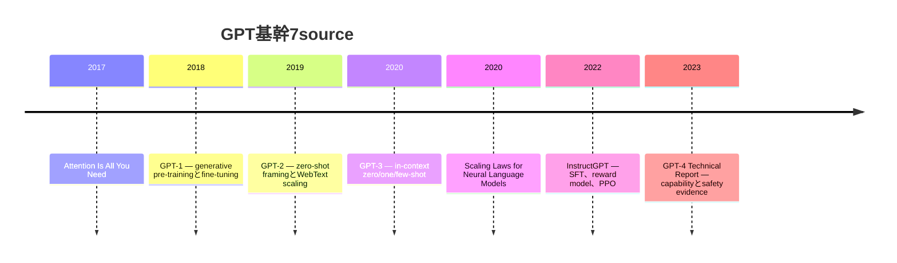
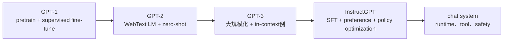
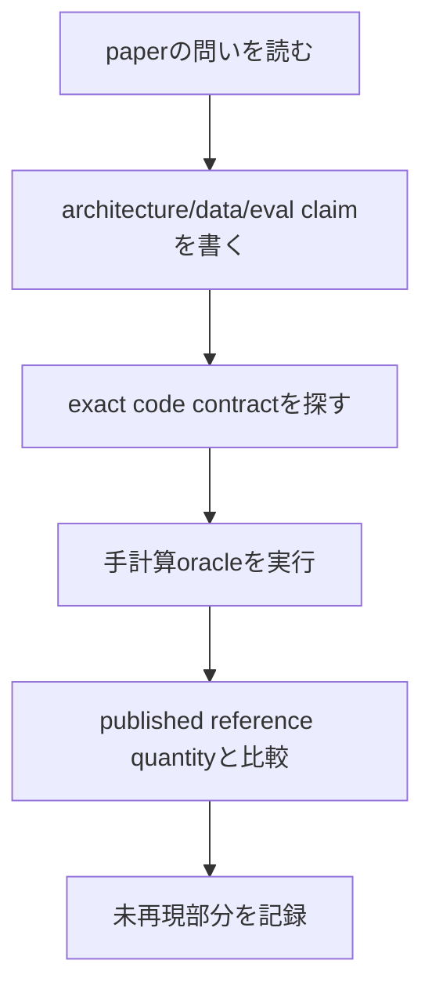

# 42 — GPT系譜、基幹7source、Karpathy実装

## この章が必要な理由

従来は*Attention Is All You Need*からGPT-3へ飛び、小さなdecoderを`MiniGPT`と呼んで
いました。これでは研究上の流れが消え、decoder-only TransformerならGPT-2とarchitectureや
checkpointが互換だと誤解されます。実際には互換ではありません。

この章はpaperの主張、実装の正確なarchitecture/training recipe、このrepositoryの小さな
mechanismを分けます。

## 「神7」は一意のbibliographyではない

「神7」は複数の推薦listに非公式に使われ、GPT論文7本を定義する一次情報のauthorityは
ありません。そこで曖昧な呼称を断定せず、比較可能な**GPT基幹7source**を明示します。

## 7sourceと実装の対応

| source | 変化 | このcourseの接続 | 単独では証明しないこと |
| --- | --- | --- | --- |
| [Attention Is All You Need](https://arxiv.org/abs/1706.03762) | recurrenceをattention encoder-decoderへ置換 | 19–20章 | decoder-only GPTのpaperではない |
| [GPT-1](https://cdn.openai.com/research-covers/language-unsupervised/language_understanding_paper.pdf) | LM pre-trainingをsupervised taskへtransfer | 17–22、31a | architectureだけでtransfer resultは出ない |
| [GPT-2](https://cdn.openai.com/better-language-models/language_models_are_unsupervised_multitask_learners.pdf) | decoder-only pre-trainingをscaleしzero-shot task framing | `GptLineage` | MiniGPTはGPT-2 weightを読めない |
| [GPT-3](https://arxiv.org/abs/2005.14165) | scaleとin-context demonstration | 21章のcausal objective | tiny modelはcapabilityやdata scaleを再現しない |
| [Scaling Laws](https://arxiv.org/abs/2001.08361) | model/data/computeの経験的power law | accountingとscaling章 | exponentは普遍定数ではない |
| [InstructGPT](https://arxiv.org/abs/2203.02155) | SFT、preference reward、PPO | 31a、未実装post-training | 1分布のpreferenceは完全alignmentでない |
| [GPT-4 Technical Report](https://arxiv.org/abs/2303.08774) | multimodal capability/safety評価 | evaluation/release evidence | architecture/data/training detailは非公開 |

## GPT-1、GPT-2、GPT-3は同義語ではない

causal next-token lossは共通の幹ですが、data、scale、normalization、tokenizer、initialization、
schedule、context、evaluation、post-trainingがsystemを変えます。

## GPT-2互換境界

`Gpt2Config`と`Gpt2ParameterInventory`はGPT-2/nanoGPTのparameter ownershipを実装します。

- learned token `[V,C]`とposition embedding `[T,C]`
- pre-LayerNorm decoder block
- bias付きcombined QKVとattention output
- 4倍幅GELU MLPとbias
- final LayerNorm
- token embeddingと共有し1回だけ数えるLM head

reference testは4checkpointのexact totalを要求します。

| checkpoint | layer | channel | head | parameter |
| --- | ---: | ---: | ---: | ---: |
| GPT-2 Small | 12 | 768 | 12 | 124,439,808 |
| GPT-2 Medium | 24 | 1,024 | 16 | 354,823,168 |
| GPT-2 Large | 36 | 1,280 | 20 | 774,030,080 |
| GPT-2 XL | 48 | 1,600 | 25 | 1,557,611,200 |

`./learn-ai gpt-lineage`はinventoryと、MiniGPT固有formatに残る非互換理由を表示します。

repositoryには別実装の実行可能な`Gpt2Block`も追加しました。pre-LayerNorm、GPT-2の
tanh近似GELU、bias付きattention/MLP、residual branchを実装しています。
`Gpt2Checkpoint.loadBlock`は1 blockが所有するHugging Face/nanoGPTの12 tensor名を受け、
全name/shapeを先に検証してから、結合された`attn.c_attn`をQ、K、Vのcolumn/biasへ分割します。
testはLayerNorm数値勾配、parameter ownership、不正checkpoint拒否、QKVの値、load後forwardを
検証します。

`Gpt2Model`はlearned token/position embedding、全GPT-2 block、final LayerNorm、tied vocabulary
projectionを結合します。testはclosed-form parameter ownership、output shape、prefix causality、
tied embeddingへのgradientを検証します。残るcheckpoint workはreal containerからwhole graphへ
loadしてlogit比較することです。

`Gpt2Tokenizer`は256値bytes-to-Unicode bijection、Unicode category pre-tokenization、
lowest-rank adjacent BPE merge、strict UTF-8 decode、`encoder.json`と`vocab.bpe` parserを
実装します。testは全256 byte fixture、多言語、emoji、leading space、merge rank、unknown ID、
不正artifactを扱います。algorithm/artifact contractは完成しましたが、公式50,257-entry artifactから
作ったgolden vectorとの照合はまだ必要です。

## Karpathyの実装path

Karpathy教材は一次paperの代わりではなく、段階的構築を見せる実装です。

| source | 学ぶもの | course対応 | 残る再現test |
| --- | --- | --- | --- |
| [micrograd](https://github.com/karpathy/micrograd) | scalar autodiffとMLP | 10–11章 | selected gradient比較 |
| [makemore](https://github.com/karpathy/makemore) | countからMLPまでのcharacter LM | 14–17章 | 共通corpus curve |
| [ng-video-lecture](https://github.com/karpathy/ng-video-lecture) | tokenからattention/GPTを構築 | 16–21章 | commit単位stage map |
| [nanoGPT](https://github.com/karpathy/nanoGPT) | medium GPTのtrain/fine-tune/sample | 22a–d、GPT-2 block loader | full-model import/tokenizer |
| [build-nanogpt](https://github.com/karpathy/build-nanogpt) | GPT-2 124M再現とdistributed training | inventory/block、27/29章 | forward-logit parity |
| [llm.c](https://github.com/karpathy/llm.c) | C/CUDA GPT-2 stack | complexity/precision/distributed | Scala CPUはCUDA速度を主張しない |
| [nanochat](https://github.com/karpathy/nanochat) | tokenizerからSFT/eval/chat UIまで | 全体integration target | 2026 speedrun pipeline未実装 |

nanoGPT公式READMEは現在nanoGPTを古い/deprecatedなものとしてnanochatを案内しています。
従って「Karpathy実装」とだけ書かず、比較revisionとrepositoryを固定する必要があります。

## paperからcodeを読む手順

GPT-2の最初のreference quantityがparameter inventoryです。次の強いmilestoneはexact tokenizerと
imported weightによるforward-logit parityです。別dataでlossが似るだけではparityではありません。

## 真のGPT-2再現の完了基準

1. GPT-2 byte-level BPE vocabulary/merge互換
2. LayerNorm、approximate GELU、bias、dropout-off inference、learned position
3. public checkpoint tensor name/layoutのstable mapping
4. fixed token IDでforward-logit parity
5. controlled sampling policy/RNGでparity
6. 4sizeのpublished parameter count一致
7. architectureとtraining recipe/data差分の分離

現在は6と、2のdropout-off architecture部分を実装・test済みです。1はalgorithm/parserが完成し、
公式artifact golden parityが残ります。3はblock name/layoutまで完了し、real whole-model containerは
未完了です。4、5も未完了なので、真のGPT-2再現完了とはまだ主張しません。
